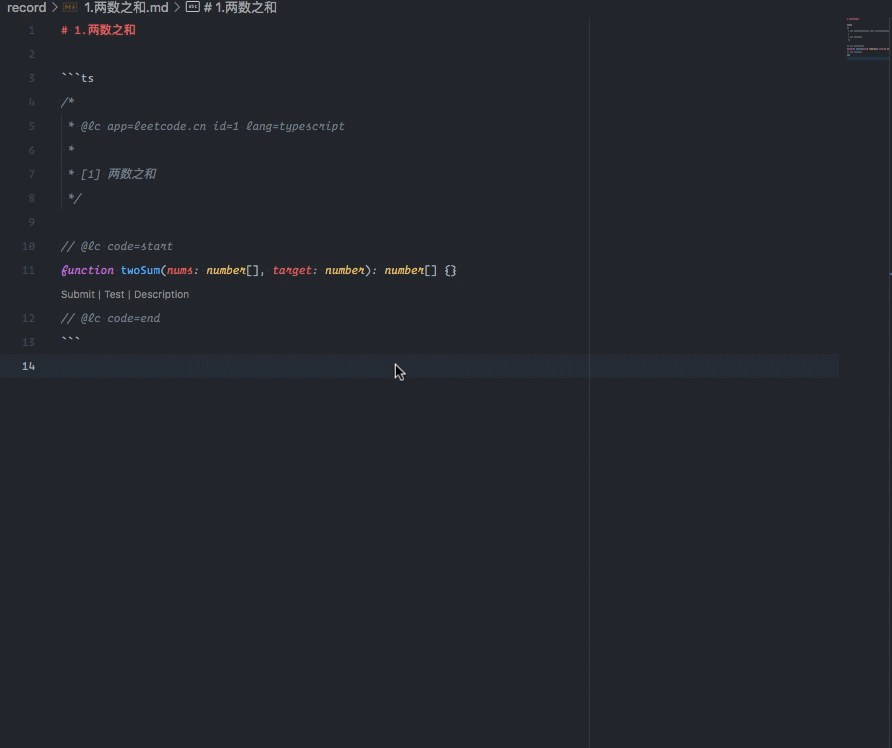

## About

- endpoint: leetcode-cn
- language: TypeScript

本仓库用来存放 LeetCode 的刷题记录,记录存放于 `record` 文件夹中,每个文件对应一题,使用`<序号>.<题目>`命名.

每个文件中分为题目,解法两部分,最后会放一部分验证的 Case.

编辑器使用 VSCode,依托于 [LeetCode](https://marketplace.visualstudio.com/items?itemName=LeetCode.vscode-leetcode) 插件,会在题目中显示 Description 按钮,点击可查看题目详情



## 使用本仓库

```sh
# 克隆本仓库
git clone https://github.com/XYShaoKang/sk-js-aigorithm.git
# 在 VSCode 中打开
code sk-js-aigorithm
```

更多详细信息请查看[使用指南](./docs/使用指南.md)

## 刷题记录

| 题目                                                                                                           | 难度 | 1     | 2     | 3      | 4     | 5                |
| -------------------------------------------------------------------------------------------------------------- | ---- | ----- | ----- | ------ | ----- | ---------------- |
| [1.两数之和](./record/1.两数之和.md)                                                                           | 简单 | 8.19  | 8.19  | 8.28   | 9.10  | 10.15            |
| [26.删除有序数组中的重复项](./record/26.删除有序数组中的重复项.md)                                             | 简单 | 8.19  | 8.28  | 9.10   | 9.17  | 10.15            |
| [283.移动零](./record/283.移动零.md)                                                                           | 简单 | 8.19  | 8.28  | 9.10   | 9.17  | 10.15            |
| [11.盛最多水的容器](./record/11.盛最多水的容器.md)                                                             | 中等 | 8.19  | 8.29  | 9.10   | 9.17  | 11.15            |
| [70.爬楼梯](./record/70.爬楼梯.md)                                                                             | 简单 | 8.19  | 9.10  | 9.14   | 9.17  | 10.4/10.11/10.17 |
| [15.三数之和](./record/15.三数之和.md)                                                                         | 中等 | 8.19  | 9.10  | 9.17   | 11.15 |                  |
| [206.反转链表](./record/206.反转链表.md)                                                                       | 简单 | 9.10  | 9.13  | 9.17   | 10.16 | 11.15            |
| [141.环形链表](./record/141.环形链表.md)                                                                       | 简单 | 9.10  | 9.13  | 9.17   | 10.17 | 11.15            |
| [20.有效的括号](./record/20.有效的括号.md)                                                                     | 简单 | 9.11  | 9.13  | 9.20   | 10.17 |                  |
| [155.最小栈](./record/155.最小栈.md)                                                                           | 简单 | 9.11  | 9.13  | 9.20   | 10.17 | 11.15            |
| [84.柱状图中最大的矩形](./record/84.柱状图中最大的矩形.md)                                                     | 困难 | 9.12  | 9.13  | 9.28   | 11.26 |                  |
| [239.滑动窗口最大值](./record/239.滑动窗口最大值.md)                                                           | 困难 | 9.13  | 9.28  |        |       |                  |
| [641.设计循环双端队列](./record/641.设计循环双端队列.md)                                                       | 中等 | 9.13  | 9.28  | 11.15  |       |                  |
| [42.接雨水](./record/42.接雨水.md)                                                                             | 困难 | 9.13  | 9.28  | 10.22  |       |                  |
| [94.二叉树的中序遍历](./record/94.二叉树的中序遍历.md)                                                         | 简单 | 9.14  | 9.28  |        |       |                  |
| [144.二叉树的前序遍历](./record/144.二叉树的前序遍历.md)                                                       | 简单 | 9.14  | 9.29  |        |       |                  |
| [145.二叉树的后序遍历](./record/145.二叉树的后序遍历.md)                                                       | 简单 | 9.29  |       |        |       |                  |
| [590.n-叉树的后序遍历](./record/590.n-叉树的后序遍历.md)                                                       | 简单 | 9.14  | 9.29  | 210312 |       |                  |
| [589.n-叉树的前序遍历](./record/589.n-叉树的前序遍历.md)                                                       | 简单 | 9.14  | 9.29  | 3.10   |       |                  |
| [429.n-叉树的层序遍历](./record/429.n-叉树的层序遍历.md)                                                       | 中等 | 9.14  | 9.29  | 4.8    |       |                  |
| [22.括号生成](./record/22.括号生成.md)                                                                         | 中等 | 9.14  | 9.18  | 10.1   | 11.10 |                  |
| [226.翻转二叉树](./record/226.翻转二叉树.md)                                                                   | 简单 | 9.14  | 10.1  |        |       |                  |
| [98.验证二叉搜索树](./record/98.验证二叉搜索树.md)                                                             | 中等 | 9.14  | 10.1  | 10.17  |       |                  |
| [104.二叉树的最大深度](./record/104.二叉树的最大深度.md)                                                       | 简单 | 9.15  | 10.1  | 10.17  |       |                  |
| [111.二叉树的最小深度](./record/111.二叉树的最小深度.md)                                                       | 简单 | 9.15  | 10.1  |        |       |                  |
| [297.二叉树的序列化与反序列化](./record/297.二叉树的序列化与反序列化.md)                                       | 困难 | 9.15  | 9.29  |        |       |                  |
| [236.二叉树的最近公共祖先](./record/236.二叉树的最近公共祖先.md)                                               | 中等 | 9.15  | 10.1  | 11.27  |       |                  |
| [105.从前序与中序遍历序列构造二叉树](./record/105.从前序与中序遍历序列构造二叉树.md)                           | 中等 | 9.15  |       |        |       |                  |
| [77.组合](./record/77.组合.md)                                                                                 | 中等 | 9.16  |       | 11.16  |       |                  |
| [46.全排列](./record/46.全排列.md)                                                                             | 中等 | 9.16  |       |        |       |                  |
| [47.全排列-ii](./record/47.全排列-ii.md)                                                                       | 中等 | 9.16  | 11.15 |        |       |                  |
| [50.pow-x-n](./record/50.pow-x-n.md)                                                                           | 中等 | 9.17  |       |        |       |                  |
| [78.子集](./record/78.子集.md)                                                                                 | 中等 | 9.17  | 11.15 | 11.17  |       |                  |
| [169.多数元素](./record/169.多数元素.md)                                                                       | 简单 | 9.17  |       |        |       |                  |
| [17.电话号码的字母组合](./record/17.电话号码的字母组合.md)                                                     | 中等 | 9.17  |       |        |       |                  |
| [51.n-皇后](./record/51.n-皇后.md)                                                                             | 困难 | 9.17  | 11.10 | 11.17  |       |                  |
| [102.二叉树的层序遍历](./record/102.二叉树的层序遍历.md)                                                       | 中等 | 9.17  | 10.17 |        |       |                  |
| [433.最小基因变化](./record/433.最小基因变化.md)                                                               | 中等 | 9.18  | 11.11 |        |       |                  |
| [515.在每个树行中找最大值](./record/515.在每个树行中找最大值.md)                                               | 中等 | 9.18  | 11.15 |        |       |                  |
| [127.单词接龙](./record/127.单词接龙.md)                                                                       | 困难 | 9.19  | 11.11 |        |       |                  |
| [126.单词接龙-ii](./record/126.单词接龙-ii.md)                                                                 | 困难 | 9.19  |       |        |       |                  |
| [200.岛屿数量](./record/200.岛屿数量.md)                                                                       | 中等 | 9.19  | 11.9  |        |       |                  |
| [529.扫雷游戏](./record/529.扫雷游戏.md)                                                                       | 中等 | 9.20  |       |        |       |                  |
| [860.柠檬水找零](./record/860.柠檬水找零.md)                                                                   | 简单 | 9.27  |       |        |       |                  |
| [122.买卖股票的最佳时机-ii](./record/122.买卖股票的最佳时机-ii.md)                                             | 中等 | 9.27  | 10.6  | 10.15  | 10.20 |                  |
| [455.分发饼干](./record/455.分发饼干.md)                                                                       | 简单 | 9.27  |       |        |       |                  |
| [874.模拟行走机器人](./record/874.模拟行走机器人.md)                                                           | 中等 | 9.27  |       |        |       |                  |
| [55.跳跃游戏](./record/55.跳跃游戏.md)                                                                         | 中等 | 9.28  | 10.14 | 10.18  | 11.28 | 12.13            |
| [45.跳跃游戏-ii](./record/45.跳跃游戏-ii.md)                                                                   | 中等 | 9.28  | 10.14 | 10.18  |       |                  |
| [69.x-的平方根](./record/69.x-的平方根.md)                                                                     | 简单 | 9.30  |       |        |       |                  |
| [367.有效的完全平方数](./record/367.有效的完全平方数.md)                                                       | 简单 | 9.30  | 11.4  |        |       |                  |
| [33.搜索旋转排序数组](./record/33.搜索旋转排序数组.md)                                                         | 中等 | 9.30  |       |        |       |                  |
| [74.搜索二维矩阵](./record/74.搜索二维矩阵.md)                                                                 | 中等 | 9.30  |       |        |       |                  |
| [153.寻找旋转排序数组中的最小值](./record/153.寻找旋转排序数组中的最小值.md)                                   | 中等 | 10.1  |       |        |       |                  |
| [62.不同路径](./record/62.不同路径.md)                                                                         | 中等 | 10.2  | 10.28 |        |       |                  |
| [63.不同路径-ii](./record/63.不同路径-ii.md)                                                                   | 中等 | 10.3  | 10.28 |        |       |                  |
| [1143.最长公共子序列](./record/1143.最长公共子序列.md)                                                         | 中等 | 10.3  | 11.1  |        |       |                  |
| [120.三角形最小路径和](./record/120.三角形最小路径和.md)                                                       | 中等 | 10.4  | 10.26 |        |       |                  |
| [53.最大子数组和](./record/53.最大子数组和.md)                                                                 | 简单 | 10.4  | 10.14 | 10.17  | 10.18 |                  |
| [152.乘积最大子数组](./record/152.乘积最大子数组.md)                                                           | 中等 | 10.4  | 10.19 |        |       |                  |
| [322.零钱兑换](./record/322.零钱兑换.md)                                                                       | 中等 | 10.5  | 10.7  | 11.2   | 11.14 |                  |
| [198.打家劫舍](./record/198.打家劫舍.md)                                                                       | 中等 | 10.5  | 10.13 | 10.17  | 12.1  |                  |
| [213.打家劫舍-ii](./record/213.打家劫舍-ii.md)                                                                 | 中等 | 10.6  | 10.14 | 10.18  | 12.2  |                  |
| [121.买卖股票的最佳时机](./record/121.买卖股票的最佳时机.md)                                                   | 简单 | 10.6  | 10.17 | 10.20  |       |                  |
| [123.买卖股票的最佳时机-iii](./record/123.买卖股票的最佳时机-iii.md)                                           | 困难 | 10.7  |       |        |       |                  |
| [309.最佳买卖股票时机含冷冻期](./record/309.最佳买卖股票时机含冷冻期.md)                                       | 中等 | 10.8  | 10.21 |        |       |                  |
| [188.买卖股票的最佳时机-iv](./record/188.买卖股票的最佳时机-iv.md)                                             | 困难 | 10.8  |       |        |       |                  |
| [32.最长有效括号](./record/32.最长有效括号.md)                                                                 | 困难 | 10.9  |       |        |       |                  |
| [64.最小路径和](./record/64.最小路径和.md)                                                                     | 中等 | 10.9  | 10.29 |        |       |                  |
| [72.编辑距离](./record/72.编辑距离.md)                                                                         | 困难 | 10.10 | 11.1  |        |       |                  |
| [91.解码方法](./record/91.解码方法.md)                                                                         | 中等 | 10.10 | 10.23 |        |       |                  |
| [363.矩形区域不超过-k-的最大数值和](./record/363.矩形区域不超过-k-的最大数值和.md)                             | 困难 | 10.10 |       |        |       |                  |
| [509.斐波那契数](./record/509.斐波那契数.md)                                                                   | 简单 | 10.10 | 10.18 |        |       |                  |
| [1137.第-n-个泰波那契数](./record/1137.第-n-个泰波那契数.md)                                                   | 简单 | 10.10 | 10.18 |        |       |                  |
| [403.青蛙过河](./record/403.青蛙过河.md)                                                                       | 困难 | 10.11 |       |        |       |                  |
| [410.分割数组的最大值](./record/410.分割数组的最大值.md)                                                       | 困难 | 10.11 |       |        |       |                  |
| [552.学生出勤记录-ii](./record/552.学生出勤记录-ii.md)                                                         | 困难 | 10.11 | 12.12 |        |       |                  |
| [746.使用最小花费爬楼梯](./record/746.使用最小花费爬楼梯.md)                                                   | 简单 | 10.11 | 10.18 |        |       |                  |
| [552.学生出勤记录-ii](./record/552.学生出勤记录-ii.md)                                                         | 困难 | 10.12 |       |        |       |                  |
| [647.回文子串](./record/647.回文子串.md)                                                                       | 中等 | 10.12 |       |        |       |                  |
| [740.删除并获得点数](./record/740.删除并获得点数.md)                                                           | 中等 | 10.14 | 10.18 |        |       |                  |
| [918.环形子数组的最大和](./record/918.环形子数组的最大和.md)                                                   | 中等 | 10.14 | 10.18 |        |       |                  |
| [189.旋转数组](./record/189.旋转数组.md)                                                                       | 中等 | 10.15 | 11.18 |        |       |                  |
| [217.存在重复元素](./record/217.存在重复元素.md)                                                               | 简单 | 10.15 |       |        |       |                  |
| [136.只出现一次的数字](./record/136.只出现一次的数字.md)                                                       | 简单 | 10.15 | 11.17 |        |       |                  |
| [350.两个数组的交集-ii](./record/350.两个数组的交集-ii.md)                                                     | 简单 | 10.15 |       |        |       |                  |
| [66.加一](./record/66.加一.md)                                                                                 | 简单 | 10.15 |       |        |       |                  |
| [36.有效的数独](./record/36.有效的数独.md)                                                                     | 中等 | 10.15 | 11.10 |        |       |                  |
| [48.旋转图像](./record/48.旋转图像.md)                                                                         | 中等 | 10.15 |       |        |       |                  |
| [344.反转字符串](./record/344.反转字符串.md)                                                                   | 简单 | 10.15 |       |        |       |                  |
| [7.整数反转](./record/7.整数反转.md)                                                                           | 简单 | 10.15 |       |        |       |                  |
| [387.字符串中的第一个唯一字符](./record/387.字符串中的第一个唯一字符.md)                                       | 简单 | 10.15 |       |        |       |                  |
| [242.有效的字母异位词](./record/242.有效的字母异位词.md)                                                       | 简单 | 10.15 |       |        |       |                  |
| [125.验证回文串](./record/125.验证回文串.md)                                                                   | 简单 | 10.15 |       |        |       |                  |
| [8.字符串转换整数-atoi](./record/8.字符串转换整数-atoi.md)                                                     | 中等 | 10.16 |       |        |       |                  |
| [28.实现-str-str](./record/28.实现-str-str.md)                                                                 | 简单 | 10.16 |       |        |       |                  |
| [38.外观数列](./record/38.外观数列.md)                                                                         | 中等 | 10.16 |       |        |       |                  |
| [14.最长公共前缀](./record/14.最长公共前缀.md)                                                                 | 简单 | 10.16 |       |        |       |                  |
| [237.删除链表中的节点](./record/237.删除链表中的节点.md)                                                       | 简单 | 10.16 | 11.2  |        |       |                  |
| [19.删除链表的倒数第-n-个结点](./record/19.删除链表的倒数第-n-个结点.md)                                       | 中等 | 10.16 |       |        |       |                  |
| [21.合并两个有序链表](./record/21.合并两个有序链表.md)                                                         | 简单 | 10.17 |       |        |       |                  |
| [234.回文链表](./record/234.回文链表.md)                                                                       | 简单 | 10.17 |       |        |       |                  |
| [101.对称二叉树](./record/101.对称二叉树.md)                                                                   | 简单 | 10.17 |       |        |       |                  |
| [108.将有序数组转换为二叉搜索树](./record/108.将有序数组转换为二叉搜索树.md)                                   | 简单 | 10.17 |       |        |       |                  |
| [88.合并两个有序数组](./record/88.合并两个有序数组.md)                                                         | 简单 | 10.17 |       |        |       |                  |
| [278.第一个错误的版本](./record/278.第一个错误的版本.md)                                                       | 简单 | 10.17 |       |        |       |                  |
| [384.打乱数组](./record/384.打乱数组.md)                                                                       | 中等 | 10.17 | 11.22 |        |       |                  |
| [412.fizz-buzz](./record/412.fizz-buzz.md)                                                                     | 简单 | 10.17 |       |        |       |                  |
| [204.计数质数](./record/204.计数质数.md)                                                                       | 中等 | 10.17 |       |        |       |                  |
| [326.3-的幂](./record/326.3-的幂.md)                                                                           | 简单 | 10.17 |       |        |       |                  |
| [13.罗马数字转整数](./record/13.罗马数字转整数.md)                                                             | 简单 | 10.17 |       |        |       |                  |
| [191.位-1-的个数](./record/191.位-1-的个数.md)                                                                 | 简单 | 10.17 | 11.16 |        |       |                  |
| [461.汉明距离](./record/461.汉明距离.md)                                                                       | 简单 | 10.17 |       |        |       |                  |
| [190.颠倒二进制位](./record/190.颠倒二进制位.md)                                                               | 简单 | 10.17 | 11.16 |        |       |                  |
| [118.杨辉三角](./record/118.杨辉三角.md)                                                                       | 简单 | 10.17 | 10.25 |        |       |                  |
| [268.丢失的数字](./record/268.丢失的数字.md)                                                                   | 简单 | 10.17 | 11.6  |        | 11.17 |                  |
| [1567.乘积为正数的最长子数组长度](./record/1567.乘积为正数的最长子数组长度.md)                                 | 中等 | 10.19 |       |        |       |                  |
| [1014.最佳观光组合](./record/1014.最佳观光组合.md)                                                             | 中等 | 10.20 |       |        |       |                  |
| [714.买卖股票的最佳时机含手续费](./record/714.买卖股票的最佳时机含手续费.md)                                   | 中等 | 10.21 |       |        |       |                  |
| [139.单词拆分](./record/139.单词拆分.md)                                                                       | 中等 | 10.22 |       |        |       |                  |
| [413.等差数列划分](./record/413.等差数列划分.md)                                                               | 中等 | 10.23 |       |        |       |                  |
| [263.丑数](./record/263.丑数.md)                                                                               | 简单 | 10.24 |       |        |       |                  |
| [264.丑数-ii](./record/264.丑数-ii.md)                                                                         | 中等 | 10.24 |       |        |       |                  |
| [96.不同的二叉搜索树](./record/96.不同的二叉搜索树.md)                                                         | 中等 | 10.24 |       |        |       |                  |
| [208.实现-trie-前缀树](./record/208.实现-trie-前缀树.md)                                                       | 中等 | 10.24 | 11.28 |        |       |                  |
| [79.单词搜索](./record/79.单词搜索.md)                                                                         | 中等 | 10.25 |       |        |       |                  |
| [212.单词搜索-ii](./record/212.单词搜索-ii.md)                                                                 | 困难 | 10.25 |       |        |       |                  |
| [119.杨辉三角-ii](./record/119.杨辉三角-ii.md)                                                                 | 简单 | 10.25 | 12.12 |        |       |                  |
| [931.下降路径最小和](./record/931.下降路径最小和.md)                                                           | 中等 | 10.26 |       |        |       |                  |
| [1314.矩阵区域和](./record/1314.矩阵区域和.md)                                                                 | 中等 | 10.27 |       |        |       |                  |
| [304.二维区域和检索-矩阵不可变](./record/304.二维区域和检索-矩阵不可变.md)                                     | 中等 | 10.29 |       |        |       |                  |
| [221.最大正方形](./record/221.最大正方形.md)                                                                   | 中等 | 10.29 | 12.12 |        |       |                  |
| [5.最长回文子串](./record/5.最长回文子串.md)                                                                   | 中等 | 10.30 | 12.3  | 1.14   |       |                  |
| [516.最长回文子序列](./record/516.最长回文子序列.md)                                                           | 中等 | 10.30 |       |        |       |                  |
| [300.最长递增子序列](./record/300.最长递增子序列.md)                                                           | 中等 | 10.31 | 12.4  |        |       |                  |
| [376.摆动序列](./record/376.摆动序列.md)                                                                       | 中等 | 10.31 |       |        |       |                  |
| [392.判断子序列](./record/392.判断子序列.md)                                                                   | 简单 | 11.1  |       |        |       |                  |
| [575.分糖果](./record/575.分糖果.md)                                                                           | 简单 | 11.1  |       |        |       |                  |
| [518.零钱兑换-ii](./record/518.零钱兑换-ii.md)                                                                 | 中等 | 11.2  | 11.14 |        |       |                  |
| [407.接雨水-ii](./record/407.接雨水-ii.md)                                                                     | 困难 | 11.3  |       |        |       |                  |
| [377.组合总和-ⅳ](./record/377.组合总和-ⅳ.md)                                                                   | 中等 | 11.4  |       |        |       |                  |
| [343.整数拆分](./record/343.整数拆分.md)                                                                       | 中等 | 11.4  |       |        |       |                  |
| [279.完全平方数](./record/279.完全平方数.md)                                                                   | 中等 | 11.4  |       |        |       |                  |
| [1218.最长定差子序列](./record/1218.最长定差子序列.md)                                                         | 中等 | 11.5  |       |        |       |                  |
| [598.范围求和-ii](./record/598.范围求和-ii.md)                                                                 | 简单 | 11.7  |       |        |       |                  |
| [299.猜数字游戏](./record/299.猜数字游戏.md)                                                                   | 中等 | 11.8  |       |        |       |                  |
| [547.省份数量](./record/547.省份数量.md)                                                                       | 中等 | 11.9  |       |        |       |                  |
| [130.被围绕的区域](./record/130.被围绕的区域.md)                                                               | 中等 | 11.9  |       |        |       |                  |
| [488.祖玛游戏](./record/488.祖玛游戏.md)                                                                       | 困难 | 11.9  |       |        |       |                  |
| [495.提莫攻击](./record/495.提莫攻击.md)                                                                       | 简单 | 11.10 |       |        |       |                  |
| [629.k 个逆序对数组](./record/629.k个逆序对数组.md)                                                            | 困难 | 11.11 |       |        |       |                  |
| [37.解数独](./record/37.解数独.md)                                                                             | 困难 | 11.11 |       |        |       |                  |
| [375.猜数字大小-ii](./record/375.猜数字大小-ii.md)                                                             | 中等 | 11.12 | 12.12 |        |       |                  |
| [520.检测大写字母](./record/520.检测大写字母.md)                                                               | 简单 | 11.13 |       |        |       |                  |
| [677.键值映射](./record/677.键值映射.md)                                                                       | 中等 | 11.14 |       |        |       |                  |
| [319.灯泡开关](./record/319.灯泡开关.md)                                                                       | 中等 | 11.15 |       |        |       |                  |
| [391.完美矩形](./record/391.完美矩形.md)                                                                       | 困难 | 11.16 |       |        |       |                  |
| [231.2-的幂](./record/231.2-的幂.md)                                                                           | 简单 | 11.16 |       |        |       |                  |
| [52.n 皇后-ii](./record/52.n皇后-ii.md)                                                                        | 困难 | 11.17 |       |        |       |                  |
| [338.比特位计数](./record/338.比特位计数.md)                                                                   | 简单 | 11.17 |       |        |       |                  |
| [90.子集-ii](./record/90.子集-ii.md)                                                                           | 中等 | 11.17 |       |        |       |                  |
| [318.最大单词长度乘积](./record/318.最大单词长度乘积.md)                                                       | 中等 | 11.17 |       |        |       |                  |
| [287.寻找重复数](./record/287.寻找重复数.md)                                                                   | 中等 | 11.17 |       |        |       |                  |
| [563.二叉树的坡度](./record/563.二叉树的坡度.md)                                                               | 简单 | 11.18 |       |        |       |                  |
| [912.排序数组](./record/912.排序数组.md)                                                                       | 中等 | 11.18 |       |        |       |                  |
| [1122.数组的相对排序](./record/1122.数组的相对排序.md)                                                         | 简单 | 11.18 |       |        |       |                  |
| [397.整数替换](./record/397.整数替换.md)                                                                       | 中等 | 11.19 |       |        |       |                  |
| [594.最长和谐子序列](./record/594.最长和谐子序列.md)                                                           | 简单 | 11.20 |       |        |       |                  |
| [559.n-叉树的最大深度](./record/559.n-叉树的最大深度.md)                                                       | 简单 | 11.21 |       |        |       |                  |
| [859.亲密字符串](./record/859.亲密字符串.md)                                                                   | 简单 | 11.23 |       |        |       |                  |
| [423.从英文中重建数字](./record/423.从英文中重建数字.md)                                                       | 中等 | 11.24 |       |        |       |                  |
| [39.组合总和](./record/39.组合总和.md)                                                                         | 中等 | 11.24 |       |        |       |                  |
| [34.在排序数组中查找元素的第一个和最后一个位置](./record/34.在排序数组中查找元素的第一个和最后一个位置.md)     | 中等 | 11.24 |       |        |       |                  |
| [458.可怜的小猪](./record/458.可怜的小猪.md)                                                                   | 困难 | 11.25 |       |        |       |                  |
| [700.二叉搜索树中的搜索](./record/700.二叉搜索树中的搜索.md)                                                   | 简单 | 11.26 |       |        |       |                  |
| [519.随机翻转矩阵](./record/519.随机翻转矩阵.md)                                                               | 中等 | 11.27 |       |        |       |                  |
| [148.排序链表](./record/148.排序链表.md)                                                                       | 中等 | 11.27 |       |        |       |                  |
| [147.对链表进行插入排序](./record/147.对链表进行插入排序.md)                                                   | 中等 | 11.27 |       |        |       |                  |
| [494.目标和](./record/494.目标和.md)                                                                           | 中等 | 11.27 |       |        |       |                  |
| [438.找到字符串中所有字母异位词](./record/438.找到字符串中所有字母异位词.md)                                   | 中等 | 11.28 |       |        |       |                  |
| [394.字符串解码](./record/394.字符串解码.md)                                                                   | 中等 | 11.28 |       |        |       |                  |
| [786.第-k-个最小的素数分数](./record/786.第-k-个最小的素数分数.md)                                             | 困难 | 11.29 |       |        |       |                  |
| [312.戳气球](./record/312.戳气球.md)                                                                           | 困难 | 11.29 |       |        |       |                  |
| [400.第-n-位数字](./record/400.第-n-位数字.md)                                                                 | 中等 | 11.30 |       |        |       |                  |
| [1446.连续字符](./record/1446.连续字符.md)                                                                     | 简单 | 12.1  |       |        |       |                  |
| [506.相对名次](./record/506.相对名次.md)                                                                       | 简单 | 12.2  |       |        |       |                  |
| [1005.k-次取反后最大化的数组和](./record/1005.k-次取反后最大化的数组和.md)                                     | 简单 | 12.3  |       |        |       |                  |
| [383.赎金信](./record/383.赎金信.md)                                                                           | 简单 | 12.4  |       |        |       |                  |
| [372.超级次方](./record/372.超级次方.md)                                                                       | 中等 | 12.5  |       |        |       |                  |
| [10.正则表达式匹配](./record/10.正则表达式匹配.md)                                                             | 困难 | 12.5  |       |        |       |                  |
| [1816.截断句子](./record/1816.截断句子.md)                                                                     | 简单 | 12.6  |       |        |       |                  |
| [1034.边框着色](./record/1034.边框着色.md)                                                                     | 中等 | 12.7  |       |        |       |                  |
| [689.三个无重叠子数组的最大和](./record/689.三个无重叠子数组的最大和.md)                                       | 困难 | 12.8  |       |        |       |                  |
| [1674.使数组互补的最少操作次数](./record/1674.使数组互补的最少操作次数.md)                                     | 中等 | 12.8  |       |        |       |                  |
| [794.有效的井字游戏](./record/794.有效的井字游戏.md)                                                           | 中等 | 12.9  |       |        |       |                  |
| [1770.执行乘法运算的最大分数](./record/1770.执行乘法运算的最大分数.md)                                         | 中等 | 12.9  |       |        |       |                  |
| [748.最短补全词](./record/748.最短补全词.md)                                                                   | 简单 | 12.10 |       |        |       |                  |
| [911.在线选举](./record/911.在线选举.md)                                                                       | 中等 | 12.11 |       |        |       |                  |
| [1383.最大的团队表现值](./record/1383.最大的团队表现值.md)                                                     | 困难 | 12.11 |       |        |       |                  |
| [709.转换成小写字母](./record/709.转换成小写字母.md)                                                           | 简单 | 12.12 |       |        |       |                  |
| [374.猜数字大小](./record/374.猜数字大小.md)                                                                   | 简单 | 12.12 |       |        |       |                  |
| [551.学生出勤记录-i](./record/551.学生出勤记录-i.md)                                                           | 简单 | 12.12 |       |        |       |                  |
| [面试题 04.09. 二叉搜索树序列](./record/面试题 04.09. 二叉搜索树序列.md)                                       | 困难 | 12.12 |       |        |       |                  |
| [1526.形成目标数组的子数组最少增加次数](./record/1526.形成目标数组的子数组最少增加次数.md)                     | 困难 | 12.12 |       |        |       |                  |
| [807.保持城市天际线](./record/807.保持城市天际线.md)                                                           | 中等 | 12.13 |       |        |       |                  |
| [85.最大矩形](./record/85.最大矩形.md)                                                                         | 困难 | 12.13 |       |        |       |                  |
| [1745.回文串分割-iv](./record/1745.回文串分割-iv.md)                                                           | 困难 | 12.13 |       |        |       |                  |
| [630.课程表-iii](./record/630.课程表-iii.md)                                                                   | 困难 | 12.14 |       |        |       |                  |
| [851.喧闹和富有](./record/851.喧闹和富有.md)                                                                   | 中等 | 12.15 |       |        |       |                  |
| [1610.可见点的最大数目](./record/1610.可见点的最大数目.md)                                                     | 困难 | 12.16 |       |        |       |                  |
| [1518.换酒问题](./record/1518.换酒问题.md)                                                                     | 简单 | 12.17 |       |        |       |                  |
| [419.甲板上的战舰](./record/419.甲板上的战舰.md)                                                               | 中等 | 12.18 |       |        |       |                  |
| [997.找到小镇的法官](./record/997.找到小镇的法官.md)                                                           | 简单 | 12.19 |       |        |       |                  |
| [2019.解出数学表达式的学生分数](./record/2019.解出数学表达式的学生分数.md)                                     | 困难 | 12.19 |       |        |       |                  |
| [475.供暖器](./record/475.供暖器.md)                                                                           | 中等 | 12.20 |       |        |       |                  |
| [1154.一年中的第几天](./record/1154.一年中的第几天.md)                                                         | 简单 | 12.21 |       |        |       |                  |
| [686.重复叠加字符串匹配](./record/686.重复叠加字符串匹配.md)                                                   | 中等 | 12.22 |       |        |       |                  |
| [1044.最长重复子串](./record/1044.最长重复子串.md)                                                             | 困难 | 12.23 |       |        |       |                  |
| [1705.吃苹果的最大数目](./record/1705.吃苹果的最大数目.md)                                                     | 中等 | 12.24 |       |        |       |                  |
| [1609.奇偶树](./record/1609.奇偶树.md)                                                                         | 中等 | 12.25 |       |        |       |                  |
| [1078.bigram-分词](./record/1078.bigram-分词.md)                                                               | 简单 | 12.26 |       |        |       |                  |
| [825.适龄的朋友](./record/825.适龄的朋友.md)                                                                   | 中等 | 12.27 |       |        |       |                  |
| [472.连接词](./record/472.连接词.md)                                                                           | 困难 | 12.28 |       |        |       |                  |
| [1995.统计特殊四元组](./record/1995.统计特殊四元组.md)                                                         | 简单 | 12.29 |       |        |       |                  |
| [846.一手顺子](./record/846.一手顺子.md)                                                                       | 中等 | 12.30 |       |        |       |                  |
| [507.完美数](./record/507.完美数.md)                                                                           | 简单 | 12.31 |       |        |       |                  |
| [2003.每棵子树内缺失的最小基因值](./record/2003.每棵子树内缺失的最小基因值.md)                                 | 困难 | 12.31 |       |        |       |                  |
| [2022.将一维数组转变成二维数组](./record/2022.将一维数组转变成二维数组.md)                                     | 简单 | 1.1   |       |        |       |                  |
| [390.消除游戏](./record/390.消除游戏.md)                                                                       | 中等 | 1.2   |       |        |       |                  |
| [1185.一周中的第几天](./record/1185.一周中的第几天.md)                                                         | 简单 | 1.3   |       |        |       |                  |
| [913.猫和老鼠](./record/913.猫和老鼠.md)                                                                       | 困难 | 1.4   |       |        |       |                  |
| [1576.替换所有的问号](./record/1576.替换所有的问号.md)                                                         | 简单 | 1.5   |       |        |       |                  |
| [71.简化路径](./record/71.简化路径.md)                                                                         | 中等 | 1.6   |       |        |       |                  |
| [1614.括号的最大嵌套深度](./record/1614.括号的最大嵌套深度.md)                                                 | 简单 | 1.7   |       |        |       |                  |
| [89.格雷编码](./record/89.格雷编码.md)                                                                         | 中等 | 1.8   |       |        |       |                  |
| [1629.按键持续时间最长的键](./record/1629.按键持续时间最长的键.md)                                             | 简单 | 1.9   |       |        |       |                  |
| [306.累加数](./record/306.累加数.md)                                                                           | 中等 | 1.10  |       |        |       |                  |
| [1036.逃离大迷宫](./record/1036.逃离大迷宫.md)                                                                 | 困境 | 1.11  |       |        |       |                  |
| [1976.到达目的地的方案数](./record/1976.到达目的地的方案数.md)                                                 | 中等 | 1.12  |       |        |       |                  |
| [334.递增的三元子序列](./record/334.递增的三元子序列.md)                                                       | 中等 | 1.12  |       |        |       |                  |
| [1977.划分数字的方案数](./record/1977.划分数字的方案数.md)                                                     | 困难 | 1.12  |       |        |       |                  |
| [747.至少是其他数字两倍的最大数](./record/747.至少是其他数字两倍的最大数.md)                                   | 简单 | 1.13  |       |        |       |                  |
| [373.查找和最小的 k 对数字](./record/373.查找和最小的k对数字.md)                                               | 中等 | 1.14  |       |        |       |                  |
| [1716.计算力扣银行的钱](./record/1716.计算力扣银行的钱.md)                                                     | 中等 | 1.15  |       |        |       |                  |
| [382.链表随机节点](./record/382.链表随机节点.md)                                                               | 中等 | 1.16  |       |        |       |                  |
| [1220.统计元音字母序列的数目](./record/1220.统计元音字母序列的数目.md)                                         | 困难 | 1.17  |       |        |       |                  |
| [539.最小时间差](./record/539.最小时间差.md)                                                                   | 中等 | 1.18  |       |        |       |                  |
| [219.存在重复元素-ii](./record/219.存在重复元素-ii.md)                                                         | 简单 | 1.19  |       |        |       |                  |
| [2029.石子游戏-ix](./record/2029.石子游戏-ix.md)                                                               | 中等 | 1.20  |       |        |       |                  |
| [1345.跳跃游戏-iv](./record/1345.跳跃游戏-iv.md)                                                               | 困难 | 1.21  |       |        |       |                  |
| [1332.删除回文子序列](./record/1332.删除回文子序列.md)                                                         | 简单 | 1.22  |       |        |       |                  |
| [2034.股票价格波动](./record/2034.股票价格波动.md)                                                             | 中等 | 1.23  |       |        |       |                  |
| [2045.到达目的地的第二短时间](./record/2045.到达目的地的第二短时间.md)                                         | 困难 | 1.24  |       |        |       |                  |
| [1688.比赛中的配对次数](./record/1688.比赛中的配对次数.md)                                                     | 简单 | 1.25  |       |        |       |                  |
| [2013.检测正方形](./record/2013.检测正方形.md)                                                                 | 困难 | 1.26  |       |        |       |                  |
| [2047.句子中的有效单词数](./record/2047.句子中的有效单词数.md)                                                 | 简单 | 1.27  |       |        |       |                  |
| [1996.游戏中弱角色的数量](./record/1996.游戏中弱角色的数量.md)                                                 | 中等 | 1.28  |       |        |       |                  |
| [1765.地图中的最高点](./record/1765.地图中的最高点.md)                                                         | 中等 | 1.29  |       |        |       |                  |
| [884.两句话中的不常见单词](./record/884.两句话中的不常见单词.md)                                               | 简单 | 1.30  |       |        |       |                  |
| [1342.将数字变成-0-的操作次数](./record/1342.将数字变成-0-的操作次数.md)                                       | 简单 | 1.31  |       |        |       |                  |
| [1124.表现良好的最长时间段](./record/1124.表现良好的最长时间段.md)                                             | 中等 | 1.31  |       |        |       |                  |
| [1763.最长的美好子字符串](./record/1763.最长的美好子字符串.md)                                                 | 简单 | 2.1   |       |        |       |                  |
| [2000.反转单词前缀](./record/2000.反转单词前缀.md)                                                             | 简单 | 2.2   |       |        |       |                  |
| [1414.和为-k-的最少斐波那契数字数目](./record/1414.和为-k-的最少斐波那契数字数目.md)                           | 中等 | 2.3   |       |        |       |                  |
| [1725.可以形成最大正方形的矩形数目](./record/1725.可以形成最大正方形的矩形数目.md)                             | 简单 | 2.4   |       |        |       |                  |
| [1219.黄金矿工](./record/1219.黄金矿工.md)                                                                     | 中等 | 2.5   |       |        |       |                  |
| [1748.唯一元素的和](./record/1748.唯一元素的和.md)                                                             | 简单 | 2.6   |       |        |       |                  |
| [1405.最长快乐字符串](./record/1405.最长快乐字符串.md)                                                         | 中等 | 2.7   |       |        |       |                  |
| [1001.网格照明](./record/1001.网格照明.md)                                                                     | 困难 | 2.8   |       |        |       |                  |
| [2006.差的绝对值为-k-的数对数目](./record/2006.差的绝对值为-k-的数对数目.md)                                   | 简单 | 2.9   |       |        |       |                  |
| [1447.最简分数](./record/1447.最简分数.md)                                                                     | 中等 | 2.10  |       |        |       |                  |
| [1984.学生分数的最小差值](./record/1984.学生分数的最小差值.md)                                                 | 简单 | 2.11  |       |        |       |                  |
| [1020.飞地的数量](./record/1020.飞地的数量.md)                                                                 | 中等 | 2.12  |       |        |       |                  |
| [1189.气球-的最大数量](./record/1189.气球-的最大数量.md)                                                       | 简单 | 2.13  |       |        |       |                  |
| [540.有序数组中的单一元素](./record/540.有序数组中的单一元素.md)                                               | 中等 | 2.14  |       |        |       |                  |
| [1380.矩阵中的幸运数](./record/1380.矩阵中的幸运数.md)                                                         | 简单 | 2.15  |       |        |       |                  |
| [1719.重构一棵树的方案数](./record/1719.重构一棵树的方案数.md)                                                 | 困难 | 2.16  |       |        |       |                  |
| [688.马-在棋盘上的概率](./record/688.马-在棋盘上的概率.md)                                                     | 中等 | 2.17  |       |        |       |                  |
| [1791.找出星型图的中心节点](./record/1791.找出星型图的中心节点.md)                                             | 简单 | 2.18  |       |        |       |                  |
| [969.煎饼排序](./record/969.煎饼排序.md)                                                                       | 中等 | 2.19  |       |        |       |                  |
| [5999.统计数组中好三元组数目](./record/5999.统计数组中好三元组数目.md)                                         | 困难 | 2.20  |       |        |       |                  |
| [838.推多米诺](./record/838.推多米诺.md)                                                                       | 中等 | 2.21  |       |        |       |                  |
| [717.1-比特与-2-比特字符](./record/717.1-比特与-2-比特字符.md)                                                 | 简单 | 2.21  |       |        |       |                  |
| [1994.好子集的数目](./record/1994.好子集的数目.md)                                                             | 困难 | 2.22  |       |        |       |                  |
| [917.仅仅反转字母](./record/917.仅仅反转字母.md)                                                               | 简单 | 2.23  |       |        |       |                  |
| [1706.球会落何处](./record/1706.球会落何处.md)                                                                 | 中等 | 2.24  |       |        |       |                  |
| [537.复数乘法](./record/537.复数乘法.md)                                                                       | 中等 | 2.25  |       |        |       |                  |
| [2016.增量元素之间的最大差值](./record/2016.增量元素之间的最大差值.md)                                         | 简单 | 2.26  |       |        |       |                  |
| [553.最优除法](./record/553.最优除法.md)                                                                       | 中等 | 2.27  |       |        |       |                  |
| [1601.最多可达成的换楼请求数目](./record/1601.最多可达成的换楼请求数目.md)                                     | 困难 | 2.28  |       |        |       |                  |
| [6.z-字形变换](./record/6.z-字形变换.md)                                                                       | 中等 | 3.1   |       |        |       |                  |
| [564.寻找最近的回文数](./record/564.寻找最近的回文数.md)                                                       | 困难 | 3.2   |       |        |       |                  |
| [258.各位相加](./record/258.各位相加.md)                                                                       | 简单 | 3.3   |       |        |       |                  |
| [2104.子数组范围和](./record/2104.子数组范围和.md)                                                             | 中等 | 3.4   |       |        |       |                  |
| [521.最长特殊序列-ⅰ](./record/521.最长特殊序列-ⅰ.md)                                                           | 简单 | 3.5   |       |        |       |                  |
| [2100.适合打劫银行的日子](./record/2100.适合打劫银行的日子.md)                                                 | 中等 | 3.6   |       |        |       |                  |
| [504.七进制数](./record/504.七进制数.md)                                                                       | 简单 | 3.7   |       |        |       |                  |
| [2055.蜡烛之间的盘子](./record/2055.蜡烛之间的盘子.md)                                                         | 中等 | 3.8   |       |        |       |                  |
| [798.得分最高的最小轮调](./record/798.得分最高的最小轮调.md)                                                   | 困难 | 3.9   |       |        |       |                  |
| [2049.统计最高分的节点数目](./record/2049.统计最高分的节点数目.md)                                             | 中等 | 3.11  |       |        |       |                  |
| [393.utf-8-编码验证](./record/393.utf-8-编码验证.md)                                                           | 中等 | 3.13  |       |        |       |                  |
| [599.两个列表的最小索引总和](./record/599.两个列表的最小索引总和.md)                                           | 简单 | 3.14  |       |        |       |                  |
| [2044.统计按位或能得到最大值的子集数目](./record/2044.统计按位或能得到最大值的子集数目.md)                     | 中等 | 3.15  |       |        |       |                  |
| [432.全-o-1-的数据结构](./record/432.全-o-1-的数据结构.md)                                                     | 困难 | 3.16  |       |        |       |                  |
| [720.词典中最长的单词](./record/720.词典中最长的单词.md)                                                       | 简单 | 3.17  |       |        |       |                  |
| [2043.简易银行系统](./record/2043.简易银行系统.md)                                                             | 中等 | 3.18  |       |        |       |                  |
| [606.根据二叉树创建字符串](./record/606.根据二叉树创建字符串.md)                                               | 简单 | 3.19  |       |        |       |                  |
| [2039.网络空闲的时刻](./record/2039.网络空闲的时刻.md)                                                         | 中等 | 3.20  |       |        |       |                  |
| [653.两数之和-iv-输入-bst](./record/653.两数之和-iv-输入-bst.md)                                               | 简单 | 3.21  |       |        |       |                  |
| [2038.如果相邻两个颜色均相同则删除当前颜色](./record/2038.如果相邻两个颜色均相同则删除当前颜色.md)             | 中等 | 3.22  |       |        |       |                  |
| [440.字典序的第 k 小数字](./record/440.字典序的第k小数字.md)                                                   | 困难 | 3.23  |       |        |       |                  |
| [661.图片平滑器](./record/661.图片平滑器.md)                                                                   | 简单 | 3.24  |       |        |       |                  |
| [172.阶乘后的零](./record/172.阶乘后的零.md)                                                                   | 中等 | 3.25  |       |        |       |                  |
| [682.棒球比赛](./record/682.棒球比赛.md)                                                                       | 简单 | 3.26  |       |        |       |                  |
| [2028.找出缺失的观测数据](./record/2028.找出缺失的观测数据.md)                                                 | 中等 | 3.27  |       |        |       |                  |
| [693.交替位二进制数](./record/693.交替位二进制数.md)                                                           | 简单 | 3.28  |       |        |       |                  |
| [2024.考试的最大困扰度](./record/2024.考试的最大困扰度.md)                                                     | 中等 | 3.29  |       |        |       |                  |
| [1606.找到处理最多请求的服务器](./record/1606.找到处理最多请求的服务器.md)                                     | 困难 | 3.30  |       |        |       |                  |
| [728.自除数](./record/728.自除数.md)                                                                           | 简单 | 3.31  |       |        |       |                  |
| [954.二倍数对数组](./record/954.二倍数对数组.md)                                                               | 中等 | 4.1   |       |        |       |                  |
| [420.强密码检验器](./record/420.强密码检验器.md)                                                               | 困难 | 4.2   |       |        |       |                  |
| [744.寻找比目标字母大的最小字母](./record/744.寻找比目标字母大的最小字母.md)                                   | 简单 | 4.3   |       |        |       |                  |
| [307.区域和检索-数组可修改](./record/307.区域和检索-数组可修改.md)                                             | 中等 | 4.4   |       |        |       |                  |
| [762.二进制表示中质数个计算置位](./record/762.二进制表示中质数个计算置位.md)                                   | 简单 | 4.5   |       |        |       |                  |
| [310.最小高度树](./record/310.最小高度树.md)                                                                   | 中等 | 4.6   |       |        |       |                  |
| [796.旋转字符串](./record/796.旋转字符串.md)                                                                   | 简单 | 4.7   |       |        |       |                  |
| [780.到达终点](./record/780.到达终点.md)                                                                       | 困难 | 4.9   |       |        |       |                  |
| [804.唯一摩尔斯密码词](./record/804.唯一摩尔斯密码词.md)                                                       | 简单 | 4.10  |       |        |       |                  |
| [357.计算各个位数不同的数字个数](./record/357.计算各个位数不同的数字个数.md)                                   | 中等 | 4.11  |       |        |       |                  |
| [806.写字符串需要的行数](./record/806.写字符串需要的行数.md)                                                   | 中等 | 4.12  |       |        |       |                  |
| [380.o-1-时间插入、删除和获取随机元素](./record/380.o-1-时间插入、删除和获取随机元素.md)                       | 中等 | 4.13  |       |        |       |                  |
| [1672.最富有客户的资产总量](./record/1672.最富有客户的资产总量.md)                                             | 简单 | 4.14  |       |        |       |                  |
| [385.迷你语法分析器](./record/385.迷你语法分析器.md)                                                           | 中等 | 4.15  |       |        |       |                  |
| [479.最大回文数乘积](./record/479.最大回文数乘积.md)                                                           | 困难 | 4.16  |       |        |       |                  |
| [819.最常见的单词](./record/819.最常见的单词.md)                                                               | 简单 | 4.17  |       |        |       |                  |
| [386.字典序排数](./record/386.字典序排数.md)                                                                   | 中等 | 4.18  |       |        |       |                  |
| [821.字符的最短距离](./record/821.字符的最短距离.md)                                                           | 简单 | 4.19  |       |        |       |                  |
| [388.文件的最长绝对路径](./record/388.文件的最长绝对路径.md)                                                   | 中等 | 4.20  |       |        |       |                  |
| [824.山羊拉丁文](./record/824.山羊拉丁文.md)                                                                   | 简单 | 4.21  |       |        |       |                  |
| [396.旋转函数](./record/396.旋转函数.md)                                                                       | 中等 | 4.22  |       |        |       |                  |
| [587.安装栅栏](./record/587.安装栅栏.md)                                                                       | 困难 | 4.23  |       |        |       |                  |
| [868.二进制间距](./record/868.二进制间距.md)                                                                   | 简单 | 4.24  |       |        |       |                  |
| [398.随机数索引](./record/398.随机数索引.md)                                                                   | 中等 | 4.25  |       |        |       |                  |
| [883.三维形体投影面积](./record/883.三维形体投影面积.md)                                                       | 简单 | 4.26  |       |        |       |                  |
| [417.太平洋大西洋水流问题](./record/417.太平洋大西洋水流问题.md)                                               | 中等 | 4.27  |       |        |       |                  |
| [905.按奇偶排序数组](./record/905.按奇偶排序数组.md)                                                           | 简单 | 4.28  |       |        |       |                  |
| [427.建立四叉树](./record/427.建立四叉树.md)                                                                   | 中等 | 4.29  |       |        |       |                  |
| [908.最小差值-i](./record/908.最小差值-i.md)                                                                   | 简单 | 4.30  |       |        |       |                  |
| [1305.两棵二叉搜索树中的所有元素](./record/1305.两棵二叉搜索树中的所有元素.md)                                 | 中等 | 5.1   |       |        |       |                  |
| [591.标签验证器](./record/591.标签验证器.md)                                                                   | 困难 | 5.2   |       |        |       |                  |
| [937.重新排列日志文件](./record/937.重新排列日志文件.md)                                                       | 简单 | 5.3   |       |        |       |                  |
| [1823.找出游戏的获胜者](./record/1823.找出游戏的获胜者.md)                                                     | 中等 | 5.4   |       |        |       |                  |
| [713.乘积小于 k 的子数组](./record/713.乘积小于k的子数组.md)                                                   | 中等 | 5.5   |       |        |       |                  |
| [933.最近的请求次数](./record/933.最近的请求次数.md)                                                           | 简单 | 5.6   |       |        |       |                  |
| [433.最小基因变化](./record/433.最小基因变化.md)                                                               | 中等 | 5.7   |       |        |       |                  |
| [442.数组中重复的数据](./record/442.数组中重复的数据.md)                                                       | 中等 | 5.8   |       |        |       |                  |
| [942.增减字符串匹配](./record/942.增减字符串匹配.md)                                                           | 简单 | 5.9   |       |        |       |                  |
| [1728.猫和老鼠-ii](./record/1728.猫和老鼠-ii.md)                                                               | 困难 | 5.10  |       |        |       |                  |
| [449.序列化和反序列化二叉搜索树](./record/449.序列化和反序列化二叉搜索树.md)                                   | 中等 | 5.11  |       |        |       |                  |
| [944.删列造序](./record/944.删列造序.md)                                                                       | 简单 | 5.12  |       |        |       |                  |
| [面试题 01.05. 一次编辑](./record/面试题01.05.一次编辑.md)                                                     | 中等 | 5.13  |       |        |       |                  |
| [691.贴纸拼词](./record/691.贴纸拼词.md)                                                                       | 困难 | 5.14  |       |        |       |                  |
| [812.最大三角形面积](./record/812.最大三角形面积.md)                                                           | 简单 | 5.15  |       |        |       |                  |
| [面试题 04.06.后继者](./record/面试题04.06.后继者.md)                                                          | 中等 | 5.16  |       |        |       |                  |
| [953.验证外星语词典](./record/953.验证外星语词典.md)                                                           | 简单 | 5.17  |       |        |       |                  |
| [668.乘法表中第 k 小的数](./record/668.乘法表中第k小的数.md)                                                   | 困难 | 5.18  |       |        |       |                  |
| [462.最少移动次数使数组元素相等-ii](./record/462.最少移动次数使数组元素相等-ii.md)                             | 中等 | 5.19  |       |        |       |                  |
| [436.寻找右区间](./record/436.寻找右区间.md)                                                                   | 中等 | 5.20  |       |        |       |                  |
| [961.在长度-2-n-的数组中找出重复-n-次的元素](./record/961.在长度-2-n-的数组中找出重复-n-次的元素.md)           | 简单 | 5.21  |       |        |       |                  |
| [464.我能赢吗](./record/464.我能赢吗.md)                                                                       | 中等 | 5.22  |       |        |       |                  |
| [675.为高尔夫比赛砍树](./record/675.为高尔夫比赛砍树.md)                                                       | 困难 | 5.23  |       |        |       |                  |
| [965.单值二叉树](./record/965.单值二叉树.md)                                                                   | 简单 | 5.24  |       |        |       |                  |
| [467.环绕字符串中唯一的子字符串](./record/467.环绕字符串中唯一的子字符串.md)                                   | 中等 | 5.25  |       |        |       |                  |
| [699.掉落的方块](./record/699.掉落的方块.md)                                                                   | 困难 | 5.26  |       |        |       |                  |
| [面试题 17.11. 单词距离](./record/面试题17.11.单词距离.md)                                                     | 中等 | 5.27  |       |        |       |                  |
| [1021.删除最外层的括号](./record/1021.删除最外层的括号.md)                                                     | 简单 | 5.28  |       |        |       |                  |
| [468.验证 ip 地址](./record/468.验证ip地址.md)                                                                 | 中等 | 5.29  |       |        |       |                  |
| [1022.从根到叶的二进制数之和](./record/1022.从根到叶的二进制数之和.md)                                         | 简单 | 5.30  |       |        |       |                  |
| [剑指 Offer II 114. 外星文字典](./record/剑指OfferII114.外星文字典.md)                                         | 困难 | 5.31  |       |        |       |                  |
| [473.火柴拼正方形](./record/473.火柴拼正方形.md)                                                               | 中等 | 6.1   |       |        |       |                  |
| [450.删除二叉搜索树中的节点](./record/450.删除二叉搜索树中的节点.md)                                           | 中等 | 6.2   |       |        |       |                  |
| [829.连续整数求和](./record/829.连续整数求和.md)                                                               | 困难 | 6.3   |       |        |       |                  |
| [929.独特的电子邮件地址](./record/929.独特的电子邮件地址.md)                                                   | 简单 | 6.4   |       |        |       |                  |
| [478.在圆内随机生成点](./record/478.在圆内随机生成点.md)                                                       | 中等 | 6.5   |       |        |       |                  |
| [732.我的日程安排表-iii](./record/732.我的日程安排表-iii.md)                                                   | 困难 | 6.6   |       |        |       |                  |
| [875.爱吃香蕉的珂珂](./record/875.爱吃香蕉的珂珂.md)                                                           | 中等 | 6.7   |       |        |       |                  |
| [1037.有效的回旋镖](./record/1037.有效的回旋镖.md)                                                             | 简单 | 6.8   |       |        |       |                  |
| [497.非重叠矩形中的随机点](./record/497.非重叠矩形中的随机点.md)                                               | 中等 | 6.9   |       |        |       |                  |
| [730.统计不同回文子序列](./record/730.统计不同回文子序列.md)                                                   | 困难 | 6.10  |       |        |       |                  |
| [926.将字符串翻转到单调递增](./record/926.将字符串翻转到单调递增.md)                                           | 中等 | 6.11  |       |        |       |                  |
| [890.查找和替换模式](./record/890.查找和替换模式.md)                                                           | 中等 | 6.12  |       |        |       |                  |
| [1051.高度检查器](./record/1051.高度检查器.md)                                                                 | 简单 | 6.13  |       |        |       |                  |
| [498.对角线遍历](./record/498.对角线遍历.md)                                                                   | 中等 | 6.14  |       |        |       |                  |
| [719.找出第-k-小的距离对](./record/719.找出第-k-小的距离对.md)                                                 | 困难 | 6.15  |       |        |       |                  |
| [532.数组中的-k-diff-数对](./record/532.数组中的-k-diff-数对.md)                                               | 中等 | 6.16  |       |        |       |                  |
| [1089.复写零](./record/1089.复写零.md)                                                                         | 简单 | 6.17  |       |        |       |                  |
| [剑指 OfferII029.排序的循环链表](./record/剑指OfferII029.排序的循环链表.md)                                    | 中等 | 6.18  |       |        |       |                  |
| [508.出现次数最多的子树元素和](./record/508.出现次数最多的子树元素和.md)                                       | 中等 | 6.19  |       |        |       |                  |
| [715.range-模块](./record/715.range-模块.md)                                                                   | 困难 | 6.20  |       |        |       |                  |
| [1108.ip-地址无效化](./record/1108.ip-地址无效化.md)                                                           | 简单 | 6.21  |       |        |       |                  |
| [513.找树左下角的值](./record/513.找树左下角的值.md)                                                           | 中等 | 6.22  |       |        |       |                  |
| [30.串联所有单词的子串](./record/30.串联所有单词的子串.md)                                                     | 困难 | 6.23  |       |        |       |                  |
| [515.在每个树行中找最大值](./record/515.在每个树行中找最大值.md)                                               | 中等 | 6.24  |       |        |       |                  |
| [剑指 Offer II 091. 粉刷房子](./record/剑指OfferII091.粉刷房子.md)                                             | 中等 | 6.25  |       |        |       |                  |
| [710.黑名单中的随机数](./record/710.黑名单中的随机数.md)                                                       | 困难 | 6.26  |       |        |       |                  |
| [522.最长特殊序列-ii](./record/522.最长特殊序列-ii.md)                                                         | 中等 | 6.27  |       |        |       |                  |
| [324.摆动排序-ii](./record/324.摆动排序-ii.md)                                                                 | 中等 | 6.28  |       |        |       |                  |
| [535.tiny-url-的加密与解密](./record/535.tiny-url-的加密与解密.md)                                             | 中等 | 6.29  |       |        |       |                  |
| [1175.质数排列](./record/1175.质数排列.md)                                                                     | 简单 | 6.30  |       |        |       |                  |
| [241.为运算表达式设计优先级](./record/241.为运算表达式设计优先级.md)                                           | 中等 | 7.1   |       |        |       |                  |
| [871.最低加油次数](./record/871.最低加油次数.md)                                                               | 中等 | 7.2   |       |        |       |                  |
| [556.下一个更大元素-iii](./record/556.下一个更大元素-iii.md)                                                   | 中等 | 7.3   |       |        |       |                  |
| [1200.最小绝对差](./record/1200.最小绝对差.md)                                                                 | 简单 | 7.4   |       |        |       |                  |
| [729.我的日程安排表-i](./record/729.我的日程安排表-i.md)                                                       | 中等 | 7.5   |       |        |       |                  |
| [736.lisp-语法解析](./record/736.lisp-语法解析.md)                                                             | 困难 | 7.6   |       |        |       |                  |
| [648.单词替换](./record/648.单词替换.md)                                                                       | 中等 | 7.7   |       |        |       |                  |
| [1217.玩筹码](./record/1217.玩筹码.md)                                                                         | 中等 | 7.8   |       |        |       |                  |
| [873.最长的斐波那契子序列的长度](./record/873.最长的斐波那契子序列的长度.md)                                   | 中等 | 7.9   |       |        |       |                  |
| [741.摘樱桃](./record/741.摘樱桃.md)                                                                           | 困难 | 7.10  |       |        |       |                  |
| [676.实现一个魔法字典](./record/676.实现一个魔法字典.md)                                                       | 中等 | 7.11  |       |        |       |                  |
| [1252.奇数值单元格的数目](./record/1252.奇数值单元格的数目.md)                                                 | 简单 | 7.12  |       |        |       |                  |
| [735.行星碰撞](./record/735.行星碰撞.md)                                                                       | 中等 | 7.13  |       |        |       |                  |
| [745.前缀和后缀搜索](./record/745.前缀和后缀搜索.md)                                                           | 困难 | 7.14  |       |        |       |                  |
| [558.四叉树交集](./record/558.四叉树交集.md)                                                                   | 中等 | 7.15  |       |        |       |                  |
| [剑指 Offer II 041. 滑动窗口的平均值](./record/剑指OfferII041.滑动窗口的平均值.md)                             | 简单 | 7.16  |       |        |       |                  |
| [565.数组嵌套](./record/565.数组嵌套.md)                                                                       | 中等 | 7.17  |       |        |       |                  |
| [749.隔离病毒](./record/749.隔离病毒.md)                                                                       | 困难 | 7.18  |       |        |       |                  |
| [731.我的日程安排表-ii](./record/731.我的日程安排表-ii.md)                                                     | 中等 | 7.19  |       |        |       |                  |
| [1260.二维网格迁移](./record/1260.二维网格迁移.md)                                                             | 简单 | 7.20  |       |        |       |                  |
| [814.二叉树剪枝](./record/814.二叉树剪枝.md)                                                                   | 中等 | 7.21  |       |        |       |                  |
| [757.设置交集大小至少为-2](./record/757.设置交集大小至少为-2.md)                                               | 困难 | 7.22  |       |        |       |                  |
| [剑指 OfferII115.重建序列](./record/剑指OfferII115.重建序列.md)                                                | 中等 | 7.23  |       |        |       |                  |
| [1184.公交站间的距离](./record/1184.公交站间的距离.md)                                                         | 简单 | 7.24  |       |        |       |                  |
| [919.完全二叉树插入器](./record/919.完全二叉树插入器.md)                                                       | 中等 | 7.25  |       |        |       |                  |
| [1206.设计跳表](./record/1206.设计跳表.md)                                                                     | 困难 | 7.26  |       |        |       |                  |
| [592.分数加减运算](./record/592.分数加减运算.md)                                                               | 中等 | 7.27  |       |        |       |                  |
| [1331.数组序号转换](./record/1331.数组序号转换.md)                                                             | 中等 | 7.28  |       |        |       |                  |
| [593.有效的正方形](./record/593.有效的正方形.md)                                                               | 中等 | 7.29  |       |        |       |                  |
| [952.按公因数计算最大组件大小](./record/952.按公因数计算最大组件大小.md)                                       | 困难 | 7.30  |       |        |       |                  |
| [1161.最大层内元素和](./record/1161.最大层内元素和.md)                                                         | 中等 | 7.31  |       |        |       |                  |
| [1374.生成每种字符都是奇数个的字符串](./record/1374.生成每种字符都是奇数个的字符串.md)                         | 简单 | 8.1   |       |        |       |                  |
| [622.设计循环队列](./record/622.设计循环队列.md)                                                               | 中等 | 8.2   |       |        |       |                  |
| [899.有序队列](./record/899.有序队列.md)                                                                       | 困难 | 8.3   |       |        |       |                  |
| [1403.非递增顺序的最小子序列](./record/1403.非递增顺序的最小子序列.md)                                         | 简单 | 8.4   |       |        |       |                  |
| [623.在二叉树中增加一行](./record/623.在二叉树中增加一行.md)                                                   | 中等 | 8.5   |       |        |       |                  |
| [1408.数组中的字符串匹配](./record/1408.数组中的字符串匹配.md)                                                 | 简单 | 8.6   |       |        |       |                  |
| [636.函数的独占时间](./record/636.函数的独占时间.md)                                                           | 中等 | 8.7   |       |        |       |                  |
| [761.特殊的二进制序列](./record/761.特殊的二进制序列.md)                                                       | 困难 | 8.8   |       |        |       |                  |
| [1413.逐步求和得到正数的最小值](./record/1413.逐步求和得到正数的最小值.md)                                     | 简单 | 8.9   |       |        |       |                  |
| [640.求解方程](./record/640.求解方程.md)                                                                       | 中等 | 8.10  |       |        |       |                  |
| [1417.重新格式化字符串](./record/1417.重新格式化字符串.md)                                                     | 简单 | 8.11  |       |        |       |                  |
| [1282.用户分组](./record/1282.用户分组.md)                                                                     | 中等 | 8.12  |       |        |       |                  |
| [768.最多能完成排序的块-ii](./record/768.最多能完成排序的块-ii.md)                                             | 困难 | 8.13  |       |        |       |                  |
| [1422.分割字符串的最大得分](./record/1422.分割字符串的最大得分.md)                                             | 简单 | 8.14  |       |        |       |                  |
| [641.设计循环双端队列](./record/641.设计循环双端队列.md)                                                       | 中等 | 8.15  |       |        |       |                  |
| [1656.设计有序流](./record/1656.设计有序流.md)                                                                 | 简单 | 8.16  |       |        |       |                  |
| [1302.层数最深叶子节点的和](./record/1302.层数最深叶子节点的和.md)                                             | 中等 | 8.17  |       |        |       |                  |
| [1224.最大相等频率](./record/1224.最大相等频率.md)                                                             | 困难 | 8.18  |       |        |       |                  |
| [1450.在既定时间做作业的学生人数](./record/1450.在既定时间做作业的学生人数.md)                                 | 简单 | 8.19  |       |        |       |                  |
| [654.最大二叉树](./record/654.最大二叉树.md)                                                                   | 中等 | 8.20  |       |        |       |                  |
| [1455.检查单词是否为句中其他单词的前缀](./record/1455.检查单词是否为句中其他单词的前缀.md)                     | 简单 | 8.21  |       |        |       |                  |
| [655.输出二叉树](./record/655.输出二叉树.md)                                                                   | 中等 | 8.22  |       |        |       |                  |
| [782.变为棋盘](./record/782.变为棋盘.md)                                                                       | 困难 | 8.23  |       |        |       |                  |
| [1460.通过翻转子数组使两个数组相等](./record/1460.通过翻转子数组使两个数组相等.md)                             | 简单 | 8.24  |       |        |       |                  |
| [658.找到-k-个最接近的元素](./record/658.找到-k-个最接近的元素.md)                                             | 中等 | 8.25  |       |        |       |                  |
| [1464.数组中两元素的最大乘积](./record/1464.数组中两元素的最大乘积.md)                                         | 简单 | 8.26  |       |        |       |                  |
| [662.二叉树最大宽度](./record/662.二叉树最大宽度.md)                                                           | 中等 | 8.27  |       |        |       |                  |
| [793.阶乘函数后-k-个零](./record/793.阶乘函数后-k-个零.md)                                                     | 困难 | 8.28  |       |        |       |                  |
| [1470.重新排列数组](./record/1470.重新排列数组.md)                                                             | 简单 | 8.29  |       |        |       |                  |
| [998.最大二叉树-ii](./record/998.最大二叉树-ii.md)                                                             | 中等 | 8.30  |       |        |       |                  |
| [946.验证栈序列](./record/946.验证栈序列.md)                                                                   | 中等 | 8.31  |       |        |       |                  |
| [1475.商品折扣后的最终价格](./record/1475.商品折扣后的最终价格.md)                                             | 简单 | 9.1   |       |        |       |                  |
| [687.最长同值路径](./record/687.最长同值路径.md)                                                               | 中等 | 9.2   |       |        |       |                  |
| [646.最长数对链](./record/646.最长数对链.md)                                                                   | 中等 | 9.3   |       |        |       |                  |
| [1582.二进制矩阵中的特殊位置](./record/1582.二进制矩阵中的特殊位置.md)                                         | 简单 | 9.4   |       |        |       |                  |
| [652.寻找重复的子树](./record/652.寻找重复的子树.md)                                                           | 中等 | 9.5   |       |        |       |                  |
| [828.统计子串中的唯一字符](./record/828.统计子串中的唯一字符.md)                                               | 困难 | 9.6   |       |        |       |                  |
| [1592.重新排列单词间的空格](./record/1592.重新排列单词间的空格.md)                                             | 简单 | 9.7   |       |        |       |                  |
| [667.优美的排列-ii](./record/667.优美的排列-ii.md)                                                             | 中等 | 9.8   |       |        |       |                  |
| [1598.文件夹操作日志搜集器](./record/1598.文件夹操作日志搜集器.md)                                             | 简单 | 9.9   |       |        |       |                  |
| [669.修剪二叉搜索树](./record/669.修剪二叉搜索树.md)                                                           | 中等 | 9.10  |       |        |       |                  |
| [857.雇佣-k-名工人的最低成本](./record/857.雇佣-k-名工人的最低成本.md)                                         | 困难 | 9.11  |       |        |       |                  |
| [1608.特殊数组的特征值](./record/1608.特殊数组的特征值.md)                                                     | 简单 | 9.12  |       |        |       |                  |
| [670.最大交换](./record/670.最大交换.md)                                                                       | 中等 | 9.13  |       |        |       |                  |
| [1619.删除某些元素后的数组均值](./record/1619.删除某些元素后的数组均值.md)                                     | 简单 | 9.14  |       |        |       |                  |
| [672.灯泡开关-ⅱ](./record/672.灯泡开关-ⅱ.md)                                                                   | 中等 | 9.15  |       |        |       |                  |
| [850.矩形面积-ii](./record/850.矩形面积-ii.md)                                                                 | 困难 | 9.16  |       |        |       |                  |
| [1624.两个相同字符之间的最长子字符串](./record/1624.两个相同字符之间的最长子字符串.md)                         | 简单 | 9.17  |       |        |       |                  |
| [827.最大人工岛](./record/827.最大人工岛.md)                                                                   | 困难 | 9.18  |       |        |       |                  |
| [1636.按照频率将数组升序排序](./record/1636.按照频率将数组升序排序.md)                                         | 简单 | 9.19  |       |        |       |                  |
| [698.划分为 k 个相等的子集](./record/698.划分为k个相等的子集.md)                                               | 困难 | 9.20  |       |        |       |                  |
| [854.相似度为-k-的字符串](./record/854.相似度为-k-的字符串.md)                                                 | 困难 | 9.21  |       |        |       |                  |
| [1640.能否连接形成数组](./record/1640.能否连接形成数组.md)                                                     | 简单 | 9.22  |       |        |       |                  |
| [707.设计链表](./record/707.设计链表.md)                                                                       | 中等 | 9.23  |       |        |       |                  |
| [1652.拆炸弹](./record/1652.拆炸弹.md)                                                                         | 简单 | 9.24  |       |        |       |                  |
| [788.旋转数字](./record/788.旋转数字.md)                                                                       | 中等 | 9.25  |       |        |       |                  |
| [面试题 17.19.消失的两个数字](./record/面试题17.19.消失的两个数字.md)                                          | 困难 | 9.26  |       |        |       |                  |
| [面试题 01.02.判定是否互为字符重排](./record/面试题01.02.判定是否互为字符重排.md)                              | 简单 | 9.27  |       |        |       |                  |
| [面试题 17.09.第 k 个数](./record/面试题17.09.第k个数.md)                                                      | 中等 | 9.28  |       |        |       |                  |
| [面试题 01.09.字符串轮转](./record/面试题01.09.字符串轮转.md)                                                  | 简单 | 9.29  |       |        |       |                  |
| [面试题 01.08.零矩阵](./record/面试题01.08.零矩阵.md)                                                          | 中等 | 9.30  |       |        |       |                  |
| [1694.重新格式化电话号码](./record/1694.重新格式化电话号码.md)                                                 | 简单 | 10.1  |       |        |       |                  |
| [777.在 lr 字符串中交换相邻字符](./record/777.在lr字符串中交换相邻字符.md)                                     | 中等 | 10.2  |       |        |       |                  |
| [1784.检查二进制字符串字段](./record/1784.检查二进制字符串字段.md)                                             | 简单 | 10.3  |       |        |       |                  |
| [921.使括号有效的最少添加](./record/921.使括号有效的最少添加.md)                                               | 中等 | 10.4  |       |        |       |                  |
| [811.子域名访问计数](./record/811.子域名访问计数.md)                                                           | 中等 | 10.5  |       |        |       |                  |
| [927.三等分](./record/927.三等分.md)                                                                           | 困难 | 10.6  |       |        |       |                  |
| [1800.最大升序子数组和](./record/1800.最大升序子数组和.md)                                                     | 简单 | 10.7  |       |        |       |                  |
| [870.优势洗牌](./record/870.优势洗牌.md)                                                                       | 中等 | 10.8  |       |        |       |                  |
| [856.括号的分数](./record/856.括号的分数.md)                                                                   | 中等 | 10.9  |       |        |       |                  |
| [801.使序列递增的最小交换次数](./record/801.使序列递增的最小交换次数.md)                                       | 困难 | 10.10 |       |        |       |                  |
| [1790.仅执行一次字符串交换能否使两个字符串相等](./record/1790.仅执行一次字符串交换能否使两个字符串相等.md)     | 简单 | 10.11 |       |        |       |                  |
| [817.链表组件](./record/817.链表组件.md)                                                                       | 中等 | 10.12 |       |        |       |                  |
| [769.最多能完成排序的块](./record/769.最多能完成排序的块.md)                                                   | 中等 | 10.13 |       |        |       |                  |
| [940.不同的子序列-ii](./record/940.不同的子序列-ii.md)                                                         | 困难 | 10.14 |       |        |       |                  |
| [1441.用栈操作构建数组](./record/1441.用栈操作构建数组.md)                                                     | 简单 | 10.15 |       |        |       |                  |
| [886.可能的二分法](./record/886.可能的二分法.md)                                                               | 中等 | 10.16 |       |        |       |                  |
| [904.水果成篮](./record/904.水果成篮.md)                                                                       | 中等 | 10.17 |       |        |       |                  |
| [902.最大为-n-的数字组合](./record/902.最大为-n-的数字组合.md)                                                 | 困难 | 10.18 |       |        |       |                  |
| [1700.无法吃午餐的学生数量](./record/1700.无法吃午餐的学生数量.md)                                             | 简单 | 10.19 |       |        |       |                  |
| [779.第 k 个语法符号](./record/779.第k个语法符号.md)                                                           | 中等 | 10.20 |       |        |       |                  |
| [901.股票价格跨度](./record/901.股票价格跨度.md)                                                               | 中等 | 10.21 |       |        |       |                  |
| [1235.规划兼职工作](./record/1235.规划兼职工作.md)                                                             | 困难 | 10.22 |       |        |       |                  |
| [1768.交替合并字符串](./record/1768.交替合并字符串.md)                                                         | 简单 | 10.23 |       |        |       |                  |
| [915.分割数组](./record/915.分割数组.md)                                                                       | 中等 | 10.24 |       |        |       |                  |
| [934.最短的桥](./record/934.最短的桥.md)                                                                       | 中等 | 10.25 |       |        |       |                  |
| [862.和至少为-k-的最短子数组](./record/862.和至少为-k-的最短子数组.md)                                         | 困难 | 10.26 |       |        |       |                  |
| [1822.数组元素积的符号](./record/1822.数组元素积的符号.md)                                                     | 简单 | 10.27 |       |        |       |                  |
| [907.子数组的最小值之和](./record/907.子数组的最小值之和.md)                                                   | 中等 | 10.28 |       |        |       |                  |
| [1773.统计匹配检索规则的物品数量](./record/1773.统计匹配检索规则的物品数量.md)                                 | 简单 | 10.29 |       |        |       |                  |
| [784.字母大小写全排列](./record/784.字母大小写全排列.md)                                                       | 中等 | 10.30 |       |        |       |                  |
| [481.神奇字符串](./record/481.神奇字符串.md)                                                                   | 中等 | 10.31 |       |        |       |                  |
| [1662.检查两个字符串数组是否相等](./record/1662.检查两个字符串数组是否相等.md)                                 | 简单 | 11.1  |       |        |       |                  |
| [1620.网络信号最好的坐标](./record/1620.网络信号最好的坐标.md)                                                 | 中等 | 11.2  |       |        |       |                  |
| [1668.最大重复子字符串](./record/1668.最大重复子字符串.md)                                                     | 简单 | 11.3  |       |        |       |                  |
| [754.到达终点数字](./record/754.到达终点数字.md)                                                               | 中等 | 11.4  |       |        |       |                  |
| [1106.解析布尔表达式](./record/1106.解析布尔表达式.md)                                                         | 困难 | 11.5  |       |        |       |                  |
| [1678.设计-goal-解析器](./record/1678.设计-goal-解析器.md)                                                     | 简单 | 11.6  |       |        |       |                  |
| [816.模糊坐标](./record/816.模糊坐标.md)                                                                       | 中等 | 11.7  |       |        |       |                  |
| [1684.统计一致字符串的数目](./record/1684.统计一致字符串的数目.md)                                             | 简单 | 11.8  |       |        |       |                  |
| [764.最大加号标志](./record/764.最大加号标志.md)                                                               | 中等 | 11.9  |       |        |       |                  |
| [864.获取所有钥匙的最短路径](./record/864.获取所有钥匙的最短路径.md)                                           | 困难 | 11.10 |       |        |       |                  |
| [1704.判断字符串的两半是否相似](./record/1704.判断字符串的两半是否相似.md)                                     | 简单 | 11.11 |       |        |       |                  |
| [790.多米诺和托米诺平铺](./record/790.多米诺和托米诺平铺.md)                                                   | 中等 | 11.12 |       |        |       |                  |
| [791.自定义字符串排序](./record/791.自定义字符串排序.md)                                                       | 中等 | 11.13 |       |        |       |                  |
| [805.数组的均值分割](./record/805.数组的均值分割.md)                                                           | 困难 | 11.14 |       |        |       |                  |
| [1710.卡车上的最大单元数](./record/1710.卡车上的最大单元数.md)                                                 | 简单 | 11.15 |       |        |       |                  |
| [775.全局倒置与局部倒置](./record/775.全局倒置与局部倒置.md)                                                   | 中等 | 11.16 |       |        |       |                  |
| [792.匹配子序列的单词数](./record/792.匹配子序列的单词数.md)                                                   | 中等 | 11.17 |       |        |       |                  |
| [891.子序列宽度之和](./record/891.子序列宽度之和.md)                                                           | 困难 | 11.18 |       |        |       |                  |
| [1732.找到最高海拔](./record/1732.找到最高海拔.md)                                                             | 简单 | 11.19 |       |        |       |                  |
| [799.香槟塔](./record/799.香槟塔.md)                                                                           | 中等 | 11.20 |       |        |       |                  |
| [808.分汤](./record/808.分汤.md)                                                                               | 中等 | 11.21 |       |        |       |                  |
| [878.第-n-个神奇数字](./record/878.第-n-个神奇数字.md)                                                         | 困难 | 11.22 |       |        |       |                  |
| [1742.盒子中小球的最大数量](./record/1742.盒子中小球的最大数量.md)                                             | 简单 | 11.23 |       |        |       |                  |
| [795.区间子数组个数](./record/795.区间子数组个数.md)                                                           | 中等 | 11.24 |       |        |       |                  |
| [809.情感丰富的文字](./record/809.情感丰富的文字.md)                                                           | 中等 | 11.25 |       |        |       |                  |
| [882.细分图中的可到达结点](./record/882.细分图中的可到达结点.md)                                               | 困难 | 11.26 |       |        |       |                  |
| [1752.检查数组是否经排序和轮转得到](./record/1752.检查数组是否经排序和轮转得到.md)                             | 简单 | 11.27 |       |        |       |                  |
| [813.最大平均值和的分组](./record/813.最大平均值和的分组.md)                                                   | 中等 | 11.28 |       |        |       |                  |
| [1758.生成交替二进制字符串的最少操作数](./record/1758.生成交替二进制字符串的最少操作数.md)                     | 简单 | 11.29 |       |        |       |                  |
| [895.最大频率栈](./record/895.最大频率栈.md)                                                                   | 困难 | 11.30 |       |        |       |                  |
| [1779.找到最近的有相同-x-或-y-坐标的点](./record/1779.找到最近的有相同-x-或-y-坐标的点.md)                     | 简单 | 12.1  |       |        |       |                  |
| [1769.移动所有球到每个盒子所需的最小操作数](./record/1769.移动所有球到每个盒子所需的最小操作数.md)             | 中等 | 12.2  |       |        |       |                  |
| [1796.字符串中第二大的数字](./record/1796.字符串中第二大的数字.md)                                             | 简单 | 12.3  |       |        |       |                  |
| [1774.最接近目标价格的甜点成本](./record/1774.最接近目标价格的甜点成本.md)                                     | 中等 | 12.4  |       |        |       |                  |
| [1687.从仓库到码头运输箱子](./record/1687.从仓库到码头运输箱子.md)                                             | 困难 | 12.5  |       |        |       |                  |
| [1805.字符串中不同整数的数目](./record/1805.字符串中不同整数的数目.md)                                         | 简单 | 12.6  |       |        |       |                  |
| [1775.通过最少操作次数使数组的和相等](./record/1775.通过最少操作次数使数组的和相等.md)                         | 中等 | 12.7  |       |        |       |                  |
| [1812.判断国际象棋棋盘中一个格子的颜色](./record/1812.判断国际象棋棋盘中一个格子的颜色.md)                     | 简单 | 12.8  |       |        |       |                  |
| [1780.判断一个数字是否可以表示成三的幂的和](./record/1780.判断一个数字是否可以表示成三的幂的和.md)             | 中等 | 12.9  |       |        |       |                  |
| [1691.堆叠长方体的最大高度](./record/1691.堆叠长方体的最大高度.md)                                             | 困难 | 12.10 |       |        |       |                  |
| [1827.最少操作使数组递增](./record/1827.最少操作使数组递增.md)                                                 | 简单 | 12.11 |       |        |       |                  |
| [1781.所有子字符串美丽值之和](./record/1781.所有子字符串美丽值之和.md)                                         | 中等 | 12.12 |       |        |       |                  |
| [1832.判断句子是否为全字母句](./record/1832.判断句子是否为全字母句.md)                                         | 简单 | 12.13 |       |        |       |                  |
| [1697.检查边长度限制的路径是否存在](./record/1697.检查边长度限制的路径是否存在.md)                             | 困难 | 12.14 |       |        |       |                  |
| [1945.字符串转化后的各位数字之和](./record/1945.字符串转化后的各位数字之和.md)                                 | 简单 | 12.15 |       |        |       |                  |
| [1785.构成特定和需要添加的最少元素](./record/1785.构成特定和需要添加的最少元素.md)                             | 中等 | 12.16 |       |        |       |                  |
| [1764.通过连接另一个数组的子数组得到一个数组](./record/1764.通过连接另一个数组的子数组得到一个数组.md)         | 中等 | 12.17 |       |        |       |                  |
| [1703.得到连续-k-个-1-的最少相邻交换次数](./record/1703.得到连续-k-个-1-的最少相邻交换次数.md)                 | 困难 | 12.18 |       |        |       |                  |
| [1971.寻找图中是否存在路径](./record/1971.寻找图中是否存在路径.md)                                             | 简单 | 12.19 |       |        |       |                  |
| [1760.袋子里最少数目的球](./record/1760.袋子里最少数目的球.md)                                                 | 中等 | 12.20 |       |        |       |                  |
| [1753.移除石子的最大得分](./record/1753.移除石子的最大得分.md)                                                 | 中等 | 12.21 |       |        |       |                  |
| [1799.n-次操作后的最大分数和](./record/1799.n-次操作后的最大分数和.md)                                         | 困难 | 12.22 |       |        |       |                  |
| [2011.执行操作后的变量值](./record/2011.执行操作后的变量值.md)                                                 | 简单 | 12.23 |       |        |       |                  |
| [1754.构造字典序最大的合并字符串](./record/1754.构造字典序最大的合并字符串.md)                                 | 中等 | 12.24 |       |        |       |                  |
| [1739.放置盒子](./record/1739.放置盒子.md)                                                                     | 困难 | 12.25 |       |        |       |                  |
| [1759.统计同构子字符串的数目](./record/1759.统计同构子字符串的数目.md)                                         | 中等 | 12.26 |       |        |       |                  |
| [2027.转换字符串的最少操作次数](./record/2027.转换字符串的最少操作次数.md)                                     | 简单 | 12.27 |       |        |       |                  |
| [1750.删除字符串两端相同字符后的最短长度](./record/1750.删除字符串两端相同字符后的最短长度.md)                 | 中等 | 12.28 |       |        |       |                  |
| [2032.至少在两个数组中出现的值](./record/2032.至少在两个数组中出现的值.md)                                     | 简单 | 12.29 |       |        |       |                  |
| [855.考场就座](./record/855.考场就座.md)                                                                       | 中等 | 12.30 |       |        |       |                  |
| [2037.使每位学生都有座位的最少移动次数](./record/2037.使每位学生都有座位的最少移动次数.md)                     | 简单 | 12.31 |       |        |       |                  |
| [2351.第一个出现两次的字母](./record/2351.第一个出现两次的字母.md)                                             | 简单 | 1.1   |       |        |       |                  |
| [1801.积压订单中的订单总数](./record/1801.积压订单中的订单总数.md)                                             | 中等 | 1.2   |       |        |       |                  |
| [2042.检查句子中的数字是否递增](./record/2042.检查句子中的数字是否递增.md)                                     | 简单 | 1.3   |       |        |       |                  |
| [1802.有界数组中指定下标处的最大值](./record/1802.有界数组中指定下标处的最大值.md)                             | 中等 | 1.4   |       |        |       |                  |
| [1803.统计异或值在范围内的数对有多少](./record/1803.统计异或值在范围内的数对有多少.md)                         | 困难 | 1.5   |       |        |       |                  |
| [2180.统计各位数字之和为偶数的整数个数](./record/2180.统计各位数字之和为偶数的整数个数.md)                     | 简单 | 1.6   |       |        |       |                  |
| [1658.将-x-减到-0-的最小操作数](./record/1658.将-x-减到-0-的最小操作数.md)                                     | 中等 | 1.7   |       |        |       |                  |
| [2185.统计包含给定前缀的字符串](./record/2185.统计包含给定前缀的字符串.md)                                     | 简单 | 1.8   |       |        |       |                  |
| [1806.还原排列的最少操作步数](./record/1806.还原排列的最少操作步数.md)                                         | 中等 | 1.9   |       |        |       |                  |
| [753.破解保险箱](./record/753.破解保险箱.md)                                                                   | 困难 | 1.10  |       |        |       |                  |
| [2283.判断一个数的数字计数是否等于数位的值](./record/2283.判断一个数的数字计数是否等于数位的值.md)             | 简单 | 1.11  |       |        |       |                  |
| [1807.替换字符串中的括号内容](./record/1807.替换字符串中的括号内容.md)                                         | 中等 | 1.12  |       |        |       |                  |
| [2287.重排字符形成目标字符串](./record/2287.重排字符形成目标字符串.md)                                         | 简单 | 1.13  |       |        |       |                  |
| [1819.序列中不同最大公约数的数目](./record/1819.序列中不同最大公约数的数目.md)                                 | 困难 | 1.14  |       |        |       |                  |
| [2293.极大极小游戏](./record/2293.极大极小游戏.md)                                                             | 简单 | 1.15  |       |        |       |                  |
| [1813.句子相似性-iii](./record/1813.句子相似性-iii.md)                                                         | 中等 | 1.16  |       |        |       |                  |
| [1814.统计一个数组中好对子的数目](./record/1814.统计一个数组中好对子的数目.md)                                 | 中等 | 1.17  |       |        |       |                  |
| [1825.求出-mk-平均值](./record/1825.求出-mk-平均值.md)                                                         | 困难 | 1.18  |       |        |       |                  |
| [2299.强密码检验器-ii](./record/2299.强密码检验器-ii.md)                                                       | 简单 | 1.19  |       |        |       |                  |
| [1817.查找用户活跃分钟数](./record/1817.查找用户活跃分钟数.md)                                                 | 简单 | 1.20  |       |        |       |                  |
| [1824.最少侧跳次数](./record/1824.最少侧跳次数.md)                                                             | 中等 | 1.21  |       |        |       |                  |
| [1815.得到新鲜甜甜圈的最多组数](./record/1815.得到新鲜甜甜圈的最多组数.md)                                     | 困难 | 1.22  |       |        |       |                  |
| [2303.计算应缴税款总额](./record/2303.计算应缴税款总额.md)                                                     | 简单 | 1.23  |       |        |       |                  |
| [1828.统计一个圆中点的数目](./record/1828.统计一个圆中点的数目.md)                                             | 中等 | 1.24  |       |        |       |                  |
| [1632.矩阵转换后的秩](./record/1632.矩阵转换后的秩.md)                                                         | 困难 | 1.25  |       |        |       |                  |
| [1663.具有给定数值的最小字符串](./record/1663.具有给定数值的最小字符串.md)                                     | 中等 | 1.26  |       |        |       |                  |
| [2309.兼具大小写的最好英文字母](./record/2309.兼具大小写的最好英文字母.md)                                     | 简单 | 1.27  |       |        |       |                  |
| [1664.生成平衡数组的方案数](./record/1664.生成平衡数组的方案数.md)                                             | 中等 | 1.28  |       |        |       |                  |
| [2315.统计星号](./record/2315.统计星号.md)                                                                     | 简单 | 1.29  |       |        |       |                  |
| [1669.合并两个链表](./record/1669.合并两个链表.md)                                                             | 中等 | 1.30  |       |        |       |                  |
| [2319.判断矩阵是否是一个-x-矩阵](./record/2319.判断矩阵是否是一个-x-矩阵.md)                                   | 简单 | 1.31  |       |        |       |                  |
| [2325.解密消息](./record/2325.解密消息.md)                                                                     | 简单 | 2.1   |       |        |       |                  |
| [1129.颜色交替的最短路径](./record/1129.颜色交替的最短路径.md)                                                 | 中等 | 2.2   |       |        |       |                  |
| [1145.二叉树着色游戏](./record/1145.二叉树着色游戏.md)                                                         | 中等 | 2.3   |       |        |       |                  |
| [1798.你能构造出连续值的最大数目](./record/1798.你能构造出连续值的最大数目.md)                                 | 中等 | 2.4   |       |        |       |                  |
| [1210.穿过迷宫的最少移动次数](./record/1210.穿过迷宫的最少移动次数.md)                                         | 困难 | 2.5   |       |        |       |                  |
| [2331.计算布尔二叉树的值](./record/2331.计算布尔二叉树的值.md)                                                 | 简单 | 2.7   |       |        |       |                  |
| [1604.警告一小时内使用相同员工卡大于等于三次的人](./record/1604.警告一小时内使用相同员工卡大于等于三次的人.md) | 中等 | 2.7   |       |        |       |                  |
| [1233.删除子文件夹](./record/1233.删除子文件夹.md)                                                             | 中等 | 2.8   |       |        |       |                  |
| [1797.设计一个验证系统](./record/1797.设计一个验证系统.md)                                                     | 中等 | 2.9   |       |        |       |                  |
| [1223.掷骰子模拟](./record/1223.掷骰子模拟.md)                                                                 | 困难 | 2.10  |       |        |       |                  |
| [2335.装满杯子需要的最短总时长](./record/2335.装满杯子需要的最短总时长.md)                                     | 简单 | 2.11  |       |        |       |                  |
| [1138.字母板上的路径](./record/1138.字母板上的路径.md)                                                         | 中等 | 2.12  |       |        |       |                  |
| [1234.替换子串得到平衡字符串](./record/1234.替换子串得到平衡字符串.md)                                         | 中等 | 2.13  |       |        |       |                  |
| [1124.表现良好的最长时间段](./record/1124.表现良好的最长时间段.md)                                             | 中等 | 2.14  |       |        |       |                  |
| [1250.检查「好数组」](./record/1250.检查「好数组」.md)                                                         | 困难 | 2.15  |       |        |       |                  |
| [2341.数组能形成多少数对](./record/2341.数组能形成多少数对.md)                                                 | 简单 | 2.16  |       |        |       |                  |
| [1139.最大的以-1-为边界的正方形](./record/1139.最大的以-1-为边界的正方形.md)                                   | 中等 | 2.17  |       |        |       |                  |
| [1237.找出给定方程的正整数解](./record/1237.找出给定方程的正整数解.md)                                         | 中等 | 2.18  |       |        |       |                  |
| [1792.最大平均通过率](./record/1792.最大平均通过率.md)                                                         | 中等 | 2.19  |       |        |       |                  |
| [2347.最好的扑克手牌](./record/2347.最好的扑克手牌.md)                                                         | 简单 | 2.20  |       |        |       |                  |
| [1326.灌溉花园的最少水龙头数目](./record/1326.灌溉花园的最少水龙头数目.md)                                     | 困难 | 2.21  |       |        |       |                  |
| [1140.石子游戏-ii](./record/1140.石子游戏-ii.md)                                                               | 困难 | 2.22  |       |        |       |                  |
| [1238.循环码排列](./record/1238.循环码排列.md)                                                                 | 中等 | 2.23  |       |        |       |                  |
| [2357.使数组中所有元素都等于零](./record/2357.使数组中所有元素都等于零.md)                                     | 简单 | 2.24  |       |        |       |                  |
| [1247.交换字符使得字符串相同](./record/1247.交换字符使得字符串相同.md)                                         | 中等 | 2.25  |       |        |       |                  |
| [1255.得分最高的单词集合](./record/1255.得分最高的单词集合.md)                                                 | 困难 | 2.26  |       |        |       |                  |
| [1144.递减元素使数组呈锯齿状](./record/1144.递减元素使数组呈锯齿状.md)                                         | 中等 | 2.27  |       |        |       |                  |
| [2363.合并相似的物品](./record/2363.合并相似的物品.md)                                                         | 简单 | 2.28  |       |        |       |                  |
| [2373.矩阵中的局部最大值](./record/2373.矩阵中的局部最大值.md)                                                 | 简单 | 3.1   |       |        |       |                  |
| [面试题 05.02.二进制数转字符串](./record/面试题 05.02.二进制数转字符串.md)                                     | 中等 | 3.2   |       |        |       |                  |
| [1487.保证文件名唯一](./record/1487.保证文件名唯一.md)                                                         | 中等 | 3.3   |       |        |       |                  |
| [982.按位与为零的三元组](./record/982.按位与为零的三元组.md)                                                   | 困难 | 3.4   |       |        |       |                  |
| [1599.经营摩天轮的最大利润](./record/1599.经营摩天轮的最大利润.md)                                             | 中等 | 3.5   |       |        |       |                  |
| [1653.使字符串平衡的最少删除次数](./record/1653.使字符串平衡的最少删除次数.md)                                 | 中等 | 3.6   |       |        |       |                  |
| [1096.花括号展开-ii](./record/1096.花括号展开-ii.md)                                                           | 困难 | 3.7   |       |        |       |                  |
| [剑指 Offer 047. 礼物的最大价值](./record/剑指Offer047.礼物的最大价值.md)                                      | 中等 | 3.8   |       |        |       |                  |
| [2379.得到-k-个黑块的最少涂色次数](./record/2379.得到-k-个黑块的最少涂色次数.md)                               | 简单 | 3.9   |       |        |       |                  |
| [1590.使数组和能被-p-整除](./record/1590.使数组和能被-p-整除.md)                                               | 中等 | 3.10  |       |        |       |                  |
| [面试题 17.05.字母与数字](./record/面试题17.05.字母与数字.md)                                                  | 中等 | 3.11  |       |        |       |                  |
| [1617.统计子树中城市之间最大距离](./record/1617.统计子树中城市之间最大距离.md)                                 | 困难 | 3.12  |       |        |       |                  |
| [2383.赢得比赛需要的最少训练时长](./record/2383.赢得比赛需要的最少训练时长.md)                                 | 简单 | 3.13  |       |        |       |                  |
| [1605.给定行和列的和求可行矩阵](./record/1605.给定行和列的和求可行矩阵.md)                                     | 中等 | 3.14  |       |        |       |                  |
| [1615.最大网络秩](./record/1615.最大网络秩.md)                                                                 | 中等 | 3.15  |       |        |       |                  |
| [2488.统计中位数为-k-的子数组](./record/2488.统计中位数为-k-的子数组.md)                                       | 困难 | 3.16  |       |        |       |                  |
| [2389.和有限的最长子序列](./record/2389.和有限的最长子序列.md)                                                 | 简单 | 3.17  |       |        |       |                  |
| [1616.分割两个字符串得到回文串](./record/1616.分割两个字符串得到回文串.md)                                     | 中等 | 3.18  |       |        |       |                  |
| [1625.执行操作后字典序最小的字符串](./record/1625.执行操作后字典序最小的字符串.md)                             | 中等 | 3.19  |       |        |       |                  |
| [1012.至少有-1-位重复的数字](./record/1012.至少有-1-位重复的数字.md)                                           | 困难 | 3.20  |       |        |       |                  |
| [2469.温度转换](./record/2469.温度转换.md)                                                                     | 简单 | 3.21  |       |        |       |                  |
| [1626.无矛盾的最佳球队](./record/1626.无矛盾的最佳球队.md)                                                     | 中等 | 3.22  |       |        |       |                  |
| [1630.等差子数组](./record/1630.等差子数组.md)                                                                 | 中等 | 3.23  |       |        |       |                  |
| [1032.字符流](./record/1032.字符流.md)                                                                         | 困难 | 3.24  |       |        |       |                  |
| [1574.删除最短的子数组使剩余数组有序](./record/1574.删除最短的子数组使剩余数组有序.md)                         | 中等 | 3.25  |       |        |       |                  |
| [2395.和相等的子数组](./record/2395.和相等的子数组.md)                                                         | 简单 | 3.26  |       |        |       |                  |
| [1638.统计只差一个字符的子串数目](./record/1638.统计只差一个字符的子串数目.md)                                 | 中等 | 3.27  |       |        |       |                  |
| [1092.最短公共超序列](./record/1092.最短公共超序列.md)                                                         | 困难 | 3.28  |       |        |       |                  |
| [1641.统计字典序元音字符串的数目](./record/1641.统计字典序元音字符串的数目.md)                                 | 中等 | 3.29  |       |        |       |                  |
| [1637.两点之间不包含任何点的最宽垂直面积](./record/1637.两点之间不包含任何点的最宽垂直面积.md)                 | 中等 | 3.30  |       |        |       |                  |
| [2367.算术三元组的数目](./record/2367.算术三元组的数目.md)                                                     | 简单 | 3.31  |       |        |       |                  |
| [831.隐藏个人信息](./record/831.隐藏个人信息.md)                                                               | 中等 | 4.1   |       |        |       |                  |
| [1039.多边形三角剖分的最低得分](./record/1039.多边形三角剖分的最低得分.md)                                     | 中等 | 4.2   |       |        |       |                  |
| [1053.交换一次的先前排列](./record/1053.交换一次的先前排列.md)                                                 | 中等 | 4.3   |       |        |       |                  |
| [1000.合并石头的最低成本](./record/1000.合并石头的最低成本.md)                                                 | 困难 | 4.4   |       |        |       |                  |
| [2427.公因子的数目](./record/2427.公因子的数目.md)                                                             | 简单 | 4.5   |       |        |       |                  |
| [1017.负二进制转换](./record/1017.负二进制转换.md)                                                             | 中等 | 4.7   |       |        |       |                  |
| [1040.移动石子直到连续-ii](./record/1040.移动石子直到连续-ii.md)                                               | 中等 | 4.7   |       |        |       |                  |
| [1125.最小的必要团队](./record/1125.最小的必要团队.md)                                                         | 困难 | 4.8   |       |        |       |                  |
| [2399.检查相同字母间的距离](./record/2399.检查相同字母间的距离.md)                                             | 简单 | 4.9   |       |        |       |                  |
| [1019.链表中的下一个更大节点](./record/1019.链表中的下一个更大节点.md)                                         | 中等 | 4.10  |       |        |       |                  |
| [1041.困于环中的机器人](./record/1041.困于环中的机器人.md)                                                     | 中等 | 4.11  |       |        |       |                  |
| [1147.段式回文](./record/1147.段式回文.md)                                                                     | 困难 | 4.12  |       |        |       |                  |
| [2404.出现最频繁的偶数元素](./record/2404.出现最频繁的偶数元素.md)                                             | 简单 | 4.13  |       |        |       |                  |
| [1023.驼峰式匹配](./record/1023.驼峰式匹配.md)                                                                 | 中等 | 4.14  |       |        |       |                  |
| [1042.不邻接植花](./record/1042.不邻接植花.md)                                                                 | 中等 | 4.15  |       |        |       |                  |
| [1157.子数组中占绝大多数的元素](./record/1157.子数组中占绝大多数的元素.md)                                     | 困难 | 4.16  |       |        |       |                  |
| [2409.统计共同度过的日子数](./record/2409.统计共同度过的日子数.md)                                             | 简单 | 4.17  |       |        |       |                  |
| [1026.节点与其祖先之间的最大差值](./record/1026.节点与其祖先之间的最大差值.md)                                 | 中等 | 4.18  |       |        |       |                  |
| [1043.分隔数组以得到最大和](./record/1043.分隔数组以得到最大和.md)                                             | 中等 | 4.19  |       |        |       |                  |
| [1187.使数组严格递增](./record/1187.使数组严格递增.md)                                                         | 困难 | 4.20  |       |        |       |                  |
| [2413.最小偶倍数](./record/2413.最小偶倍数.md)                                                                 | 简单 | 4.21  |       |        |       |                  |
| [1027.最长等差数列](./record/1027.最长等差数列.md)                                                             | 中等 | 4.22  |       |        |       |                  |
| [1105.填充书架](./record/1105.填充书架.md)                                                                     | 中等 | 4.23  |       |        |       |                  |
| [1163.按字典序排在最后的子串](./record/1163.按字典序排在最后的子串.md)                                         | 困难 | 4.24  |       |        |       |                  |
| [2418.按身高排序](./record/2418.按身高排序.md)                                                                 | 简单 | 4.25  |       |        |       |                  |
| [1031.两个非重叠子数组的最大和](./record/1031.两个非重叠子数组的最大和.md)                                     | 中等 | 4.26  |       |        |       |                  |
| [1048.最长字符串链](./record/1048.最长字符串链.md)                                                             | 中等 | 4.27  |       |        |       |                  |
| [1172.餐盘栈](./record/1172.餐盘栈.md)                                                                         | 困难 | 4.28  |       |        |       |                  |
| [2423.删除字符使频率相同](./record/2423.删除字符使频率相同.md)                                                 | 简单 | 4.29  |       |        |       |                  |
| [1033.移动石子直到连续](./record/1033.移动石子直到连续.md)                                                     | 中等 | 4.30  |       |        |       |                  |
| [1376.通知所有员工所需的时间](./record/1376.通知所有员工所需的时间.md)                                         | 中等 | 5.1   |       |        |       |                  |
| [970.强整数](./record/970.强整数.md)                                                                           | 中等 | 5.2   |       |        |       |                  |
| [1003.检查替换后的词是否有效](./record/1003.检查替换后的词是否有效.md)                                         | 中等 | 5.3   |       |        |       |                  |
| [2106.摘水果](./record/2106.摘水果.md)                                                                         | 困难 | 5.4   |       |        |       |                  |
| [2432.处理用时最长的那个任务的员工](./record/2432.处理用时最长的那个任务的员工.md)                             | 简单 | 5.5   |       |        |       |                  |
| [1419.数青蛙](./record/1419.数青蛙.md)                                                                         | 中等 | 5.6   |       |        |       |                  |
| [1010.总持续时间可被-60-整除的歌曲](./record/1010.总持续时间可被-60-整除的歌曲.md)                             | 中等 | 5.7   |       |        |       |                  |
| [1263.推箱子](./record/1263.推箱子.md)                                                                         | 困难 | 5.8   |       |        |       |                  |
| [2437.有效时间的数目](./record/2437.有效时间的数目.md)                                                         | 简单 | 5.9   |       |        |       |                  |
| [1015.可被-k-整除的最小整数](./record/1015.可被-k-整除的最小整数.md)                                           | 中等 | 5.10  |       |        |       |                  |
| [1016.子串能表示从-1-到-n-数字的二进制串](./record/1016.子串能表示从-1-到-n-数字的二进制串.md)                 | 中等 | 5.11  |       |        |       |                  |
| [1330.翻转子数组得到最大的数组值](./record/1330.翻转子数组得到最大的数组值.md)                                 | 困难 | 5.12  |       |        |       |                  |
| [2441.与对应负数同时存在的最大正整数](./record/2441.与对应负数同时存在的最大正整数.md)                         | 简单 | 5.13  |       |        |       |                  |
| [1054.距离相等的条形码](./record/1054.距离相等的条形码.md)                                                     | 中等 | 5.15  |       |        |       |                  |
| [1072.按列翻转得到最大值等行数](./record/1072.按列翻转得到最大值等行数.md)                                     | 中等 | 5.15  |       |        |       |                  |
| [1335.工作计划的最低难度](./record/1335.工作计划的最低难度.md)                                                 | 困难 | 5.16  |       |        |       |                  |
| [2446.判断两个事件是否存在冲突](./record/2446.判断两个事件是否存在冲突.md)                                     | 简单 | 5.20  |       |        |       |                  |
| [1373.二叉搜索子树的最大键值和](./record/1373.二叉搜索子树的最大键值和.md)                                     | 困难 | 5.20  |       |        |       |                  |
| [LCP33.蓄水](./record/LCP33.蓄水.md)                                                                           | 简单 | 5.21  |       |        |       |                  |
| [1080.根到叶路径上的不足节点](./record/1080.根到叶路径上的不足节点.md)                                         | 中等 | 5.22  |       |        |       |                  |
| [1090.受标签影响的最大值](./record/1090.受标签影响的最大值.md)                                                 | 中等 | 5.23  |       |        |       |                  |
| [1377.t-秒后青蛙的位置](./record/1377.t-秒后青蛙的位置.md)                                                     | 困难 | 5.24  |       |        |       |                  |
| [2451.差值数组不同的字符串](./record/2451.差值数组不同的字符串.md)                                             | 简单 | 5.25  |       |        |       |                  |
| [1091.二进制矩阵中的最短路径](./record/1091.二进制矩阵中的最短路径.md)                                         | 中等 | 5.26  |       |        |       |                  |
| [1093.大样本统计](./record/1093.大样本统计.md)                                                                 | 中等 | 5.27  |       |        |       |                  |
| [1439.有序矩阵中的第-k-个最小数组和](./record/1439.有序矩阵中的第-k-个最小数组和.md)                           | 困难 | 5.28  |       |        |       |                  |
| [2455.可被三整除的偶数的平均值](./record/2455.可被三整除的偶数的平均值.md)                                     | 简单 | 5.29  |       |        |       |                  |
| [1110.删点成林](./record/1110.删点成林.md)                                                                     | 中等 | 5.30  |       |        |       |                  |
| [1130.叶值的最小代价生成树](./record/1130.叶值的最小代价生成树.md)                                             | 中等 | 5.31  |       |        |       |                  |

## todo

- [ ] 实现自动获取对应的 Case,进行测试
- [ ] 禁止外服自动跳转回国服,从中文站快捷跳转外服到
  - [x] 屏蔽掉`https://leetcode.com/static/cn.js`这个 url 即可防止自动跳转.我是通过在[uBlock](https://github.com/gorhill/uBlock/)中添加`leetcode.com/static/cn.js`去屏蔽这个链接.
- [ ] 添加其他过滤器
  - https://leetcode.com/discuss/feedback/944329/why-leetcode-has-removed-filter-section-for-most-recent-and-other-tabs
  - Most Posts
  - Recent Activity
  - Oldest to Newest
- [ ] 公式转换为图片
  - [ ] 将公式转换添加到 git hooks 中,提交时自动转换
  - [ ] 转换公式时,在图像标签中设置 alt 等于公式的值
- [ ] 快捷创建 md 文件
  - [ ] 快速创建测试用例
    - [x] 通过 VSCode 的用户代码片段,支持快速创建测试用例
    - [ ] 粘贴错误
      - [ ] [2087. 网格图中机器人回家的最小代价](https://leetcode-cn.com/problems/minimum-cost-homecoming-of-a-robot-in-a-grid/)
      - [ ] [10. 正则表达式匹配](https://leetcode-cn.com/problems/regular-expression-matching)
    - [x] 尝试通过脚本自动填充测试用例
      - [ ] 缓存题目列表
      - [ ] 日志
      - [ ] 错误处理
- [ ] 调试数据可视化
  - [ ] [Debug Visualizer](https://github.com/hediet/vscode-debug-visualizer/blob/master/extension/README.md)
- [ ] 专项训练
  - [ ] 滑动窗口
  - [ ] 排列组合
  - [ ] 二分查找
  - [x] 动态规划(基础)
  - [ ] 排序
  - [ ] 字符串相关
    - [ ] 预处理
      - [ ] KMP
      - [ ] 字典树
      - [ ] 存储下一个位置的索引
  - [ ] 贪心
  - [ ] 多种算法组合
