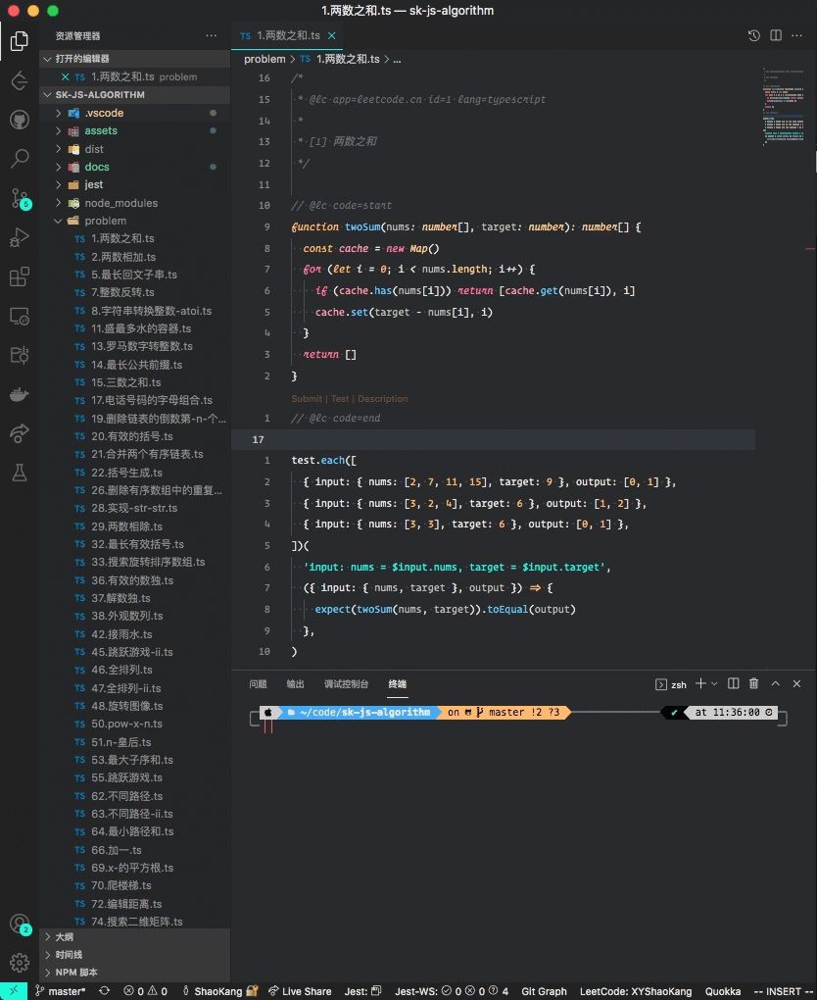
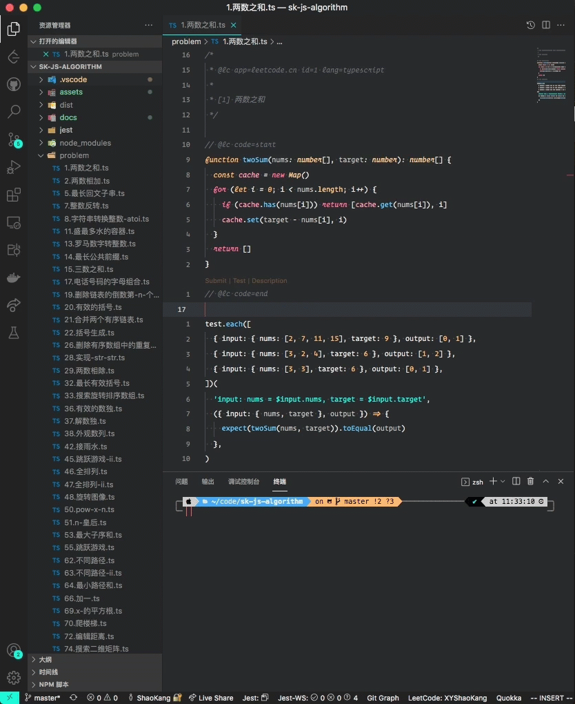

# 使用指南

## 使用本仓库

```sh
# 克隆本仓库
git clone https://github.com/XYShaoKang/sk-js-aigorithm.git
# 在 VSCode 中打开
code sk-js-aigorithm
```

安装 [LeetCode](https://marketplace.visualstudio.com/items?itemName=LeetCode.vscode-leetcode) 插件,并根据插件文档,自行进行设置

我使用的配置,替换其中`<本仓库的绝对路径>`为你实际中的路径

```json5
{
  'leetcode.endpoint': 'leetcode-cn',
  'leetcode.workspaceFolder': '<本仓库的绝对路径>',
  'leetcode.defaultLanguage': 'typescript',
  'leetcode.showDescription': 'In Webview',
  'leetcode.editor.shortcuts': ['submit', 'test', 'description'],
  'leetcode.hint.configWebviewMarkdown': false,
  'leetcode.hint.commentDescription': false,
  'leetcode.hint.commandShortcut': false,
  'leetcode.filePath': {
    default: {
      folder: 'problem',
      filename: '${id}.${kebab-case-name}.${ext}',
    },
  },
}
```

> 本仓库主要使用 TypeScript 编写,如果是使用 JavaScript 的话,有些地方需要自己调一下,比如在有些代码包含类型注解,需要将类型注解去掉,才能在 JavaScript 的环境下运行,如果有需要的话,可以提 Issue 告诉我,我可以考虑另外做一个纯 JavaScript 环境的仓库.

## 快速添加测试用例

> 目前是用代码片段的方式实现,之后考虑使用脚本自动获取的方式,可以更加方便

通过 VSCode [代码片段](https://code.visualstudio.com/docs/editor/userdefinedsnippets)的方式添加测试用例,复制题目示例中包含输入和输出行的内容(网页中或者使用 VSCode 插件显示的示例均可),然后通过输入代码片段的前缀`lc-test`(一般输入`lct`就会是第一个),再按 Tab 键即可,代码片段通过解析复制文本中的信息来生成使用 Jest 测试的代码,如下演示:


另外可以用[快捷键绑定代码片段](https://code.visualstudio.com/docs/editor/userdefinedsnippets#_assign-keybindings-to-snippets),用快捷键来快速生成测试用例,快捷键需要自己去设置,按 `Cmd+Shift+P` (Windows 下按 `Ctrl+Shift+P`)打开命令面板,然后输入`keyboard`有一个`首选项: 打开键盘快件方式(JSON)`选择之后,就会跳出快捷方式的配置文件`keybindings.json`,粘贴以下代码,将`key`中的`这里替换成想要设置的快捷键`修改为自己需要的快捷键即可,后面的注释是我设置的快捷键,仅供参考.

```json5
[
  {
    key: '这里替换成想要设置的快捷键', // cmd+ctrl+c
    command: 'editor.action.insertSnippet',
    when: 'editorTextFocus',
    args: {
      langId: 'typescript',
      name: 'leetcode test',
    },
  },
  {
    key: '这里替换成想要设置的快捷键', // cmd+ctrl+x
    command: 'editor.action.insertSnippet',
    when: 'editorTextFocus',
    args: {
      langId: 'typescript',
      name: 'leetcode test add example',
    },
  },
]
```


代码片段是通过脚本生成的,可以在 [tools/create-snippet.ts](../tools/create-snippet.ts) 查看脚本源码,以及 [.vscode/typescript.code-snippets](../.vscode/typescript.code-snippets) 查看生成的代码片段.

运行`pnpm build:snippet`(或者 `yarn build:snippet` 或者 `npm run build:snippet`)可以重新生成代码片段,如果只有自己改过 [.vscode/typescript.code-snippets](../.vscode/typescript.code-snippets) 这个文件的,记得备份自己修改过的部分

> 目前已知有两类题目无法通过这个方法直接一键生成完美的测试,需要自行添加部分代码
>
> 1. 链表,二叉树等特殊数据结构的题目(比如 [206.反转链表](https://leetcode-cn.com/problems/reverse-linked-list/),[94.二叉树的中序遍历](https://leetcode-cn.com/problems/binary-tree-inorder-traversal/)),这类题目官方给出的输入条件是进过序列化之后的(一般是数组),所以没法直接当作输入用,需要进行反序列化才行,这里可以参考后面的[测试辅助类](#测试辅助类)的说明,查看如何使用项目中内置的一些方法添加反序列化的代码.
>
> 2. 实现类的题目([208. 实现 Trie (前缀树)](https://leetcode-cn.com/problems/implement-trie-prefix-tree/),[304. 二维区域和检索 - 矩阵不可变](https://leetcode-cn.com/problems/range-sum-query-2d-immutable/)),这类题的测试用例的输入一般会给两个数组,一个数组中包含对类的操作,另外一个数组包含这些操作对应输入的参数,这就需要根据题目去自定义测试了,目前没有很好的解决办法,对于我遇到过的题目都会在这个项目中记录对应的测试,大家可以到对应的文件中复制,如果我没遇到过的,就只能靠自己自定义了,或者可以提 Issue 给我,我看到的话也会写上.

## 快速运行测试

项目内置了自定义的[任务](https://code.visualstudio.com/docs/editor/tasks),用于对当前文件进行测试,可以通过按 `Cmd+Shift+P` (Windows 下按 `Ctrl+Shift+P`) 打开命令面板,输入 tasks 选到`任务: 运行任务`回车,然后输入`run test`(自定义任务的 Label),然后回车既会以监视模式对当前文件运行测试.



另外我将这个任务设置了默认的构建任务(这个项目没多少需要构建的任务,所以不会有什么影响),而默认的构建任务可以通过 `Cmd+Shift+B` (Windows 下按 `Ctrl+Shift+B`) 来触发,所以可以通过按快捷键来触发任务更方便



当然也可以[设置自定义要绑定的快捷键](https://code.visualstudio.com/docs/editor/tasks#_binding-keyboard-shortcuts-to-tasks).

[..vscode/tasks.json](../..vscode/tasks.json)可以查看自定义任务设置.

## 测试辅助类

项目中内置了测试用的辅助类,主要是集成了一些特殊数据结构的反序列化和序列化方法.可以使用这些方法对题目中的测试用例进行反序列化得到想要的输入,并将结果进行序列化用以跟用例中的输出进行比对.

这些辅助类会在运行测试时,由 Jest 自动设置到全局,所以可以直接在测试直接使用.

[jest/setupTests.ts](../jest/setupTests.ts)这里可以查看辅助类的源码.以及类型定义[types/global.d.ts](../types/global.d.ts)

### BinaryTree

用于二叉树的反序列化,相关题目:

- [226.翻转二叉树](../record/226.翻转二叉树.md)
- [94.二叉树的中序遍历](../record/94.二叉树的中序遍历.md)
- [98.验证二叉搜索树](../record/98.验证二叉搜索树.md)

```ts
declare var BinaryTree: {
  // 序列化二叉树
  serialize(root: TreeNode | null): Array<number | null>
  // 反序列化二叉树
  deserialize(data: Array<number | null> | string): TreeNode | null
  // 对二叉树进行搜索,返回指定值对应的节点
  search(root: TreeNode | null, value: number): TreeNode | null
}

const input = [1, 2, 3, null, null, 4, 5]

const root = BinaryTree.deserialize(input)
// {
//   val: 1,
//   left: { val: 2, left: null, right: null },
//   right: {
//     val: 3,
//     left: { val: 4, left: null, right: null },
//     right: { val: 5, left: null, right: null },
//   },
// }

BinaryTree.serialize(root)
// [1, 2, 3, null, null, 4, 5]

BinaryTree.search(root, 2)
// { val: 2, left: null, right: null }
```

### NaryTree

用于 N 叉树的反序列化,相关题目:

- [590.n-叉树的后序遍历](../record/590.n-叉树的后序遍历.md)
- [589.n-叉树的前序遍历](../record/589.n-叉树的前序遍历.md)
- [429.n-叉树的层序遍历](../record/429.n-叉树的层序遍历.md)

```ts
declare var NaryTree: {
  // 反序列化 N 叉树
  deserialize(data: string | Array<number | null>): Node | null
}

const input = [1, 2, 3, null, null, 4, 5]

const root = BinaryTree.deserialize(input)
// {
//   val: 1,
//   children: [
//     {
//       val: 3,
//       children: [
//         {
//           val: 5,
//           children: [],
//         },
//         {
//           val: 6,
//           children: [],
//         },
//       ],
//     },
//     {
//       val: 2,
//       children: [],
//     },
//     {
//       val: 4,
//       children: [],
//     },
//   ],
// }
```

### LinkedList

用于链表的序列化和反序列化,相关题目:

- [206.反转链表](../record/206.反转链表.md)
- [237.删除链表中的节点](../record/237.删除链表中的节点.md)
- [141.环形链表](../record/141.环形链表.md)

```ts
declare var LinkedList: {
  // 反序列化链表
  deserialize(data: Array<number>): ListNode | null
  // 序列化链表
  serialize(root: ListNode | null): Array<number>
  // 搜索链表
  search(root: ListNode | null, val: number): ListNode | null
}

const input = [3, 2, 0, -4]

const root = LinkedList.deserialize(input)
// { val: 3, next: { val: 2, next: { val: 0, next: { val: -4, next: null } } } }

LinkedList.serialize(root)
// [3, 2, 0, -4]

LinkedList.search(root, 2)
// { val: 2, next: { val: 0, next: { val: -4, next: null } } }
```

## 关于写测试用例的几个小技巧

### 相等比较

Jest 中使用 [toBe](https://jestjs.io/docs/expect#tobevalue) 匹配器来进行基本的相等比较,`toBe` 使用 [Object.is](https://developer.mozilla.org/en-US/docs/Web/JavaScript/Reference/Global_Objects/Object/is) 来比较值是否相等,`Object.is`跟`===`的区别只有以下两点:

- 正零和负零不相等 `Object.is(0,-0) // false`
- `NaN` 会相等 `Object.is(NaN,NaN) // true`

> 我记得之前有一题(忘了具体是哪一题),力扣在进行测试时,0 和 -0 就不相等.

```ts
const [a, b] = [1, 1]
expect(a).toBe(0) // 不通过
expect(a).toBe(b) // 通过
```

### 对象的相等判断

我们知道 JavaScript 中的两个对象就算里面的数据一模一样,但也是不相等的,所以如果我们只是像判断对象的结构是否一样,就不能使用 `toBe` 去判断.Jest 提供了另外一个匹配器 [toEqual](https://jestjs.io/docs/expect#toequalvalue) 来对对象进行比较,判断两个对象是否结构相同(拥有相同属性,并且属性值相同),`toEqual` 会进行深度比较.

```ts
const [obj1, obj2] = [{ a: 1 }, { a: 1 }]
expect(obj1).toBe(obj2) // 不通过
expect(obj1).toEqual(obj2) // 通过
```

### 数组的相等判断

对数组进行比较判断时,有时候我们不在乎数组内部元素的顺序,这时候如果使用 `toEqual` 去判断,对于拥有一样的成员,但顺序不同的用例会测试失败,这个功能可以通过 [jest-extended](https://github.com/jest-community/jest-extended) 库中的 [toIncludeSameMembers](https://github.com/jest-community/jest-extended#toincludesamemembersmembers) 匹配器来实现.

`toIncludeSameMembers` 只要元素相等,并且元素的个数也需要相等,可以以任何顺序.比如下面例子中的 `arr1` 和 `arr3` 虽然都有元素 `1,2`,但 `1,2` 元素的个数不相等,所以不通过测试.

另外对于数组中如果包含了对象,也会对对象进行结构比较

```ts
const arr1 = [1, 1, 2, 2]
const arr2 = [1, 2, 1, 2]
const arr3 = [1, 2, 1, 1]

expect(arr1).toIncludeSameMembers(arr2) // 通过
expect(arr1).toIncludeSameMembers(arr3) // 不通过
```

> 不过如果是一个二维数组,或者多维数组,需要检查子元素是否具有相同元素而忽略顺序的话,`toIncludeSameMembers` 也无能为力,只能先对要判断的数据进行预处理,比如先把两者的子元素先进行排序.
