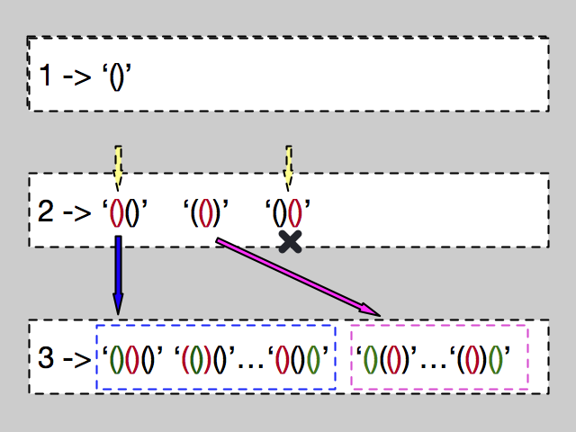

# 22.括号生成

```ts
/*
 * @lc app=leetcode.cn id=22 lang=typescript
 *
 * [22] 括号生成
 */

// @lc code=start
function generateParenthesis(n: number): string[] {}
// @lc code=end
```

## 解法 1: 递归

### 思路

使用一对括号`()`,而不是把左括号`(`右括号`)`分开来操作.这样就直接过滤掉那些无效的组合.

然后将这一对括号插入到下一层递归生成的字符串中的每个缝隙之中,就能生成这一层的所有组合.

当然这样会有很多重复的数据,所以使用 Set 去重.



### 实现

- 时间复杂度: <!-- $O(\frac{4^n}{\sqrt{n}})$ --> 
- 空间复杂度: <!-- $O(n)$ --> 

~~因为直接生成有效组合,加上去重,并且使用的层数只用 n 而不用 2n,整体的时间复杂度会比回溯法来的快,大于 2^n 小于 3^n~~

这里是我不严谨了,有点想当然,后来重新想了下,虽然迭代的层数少了,但却会花费很多步骤在生成重复数据这样的无效操作上,虽然每一层都过滤掉,但随着 n 的变大,这种重复的次数会越多,而使用回溯法的话,每次操作都是有效操作.所以实际上是会比回溯法慢的一些,不过大约是在同一个数量级的.

> 没有计算 slice 的时间复杂度,不过 V8 中有针对 slice 优化,可以默认为 O(1),其他引擎待考察
> https://stackoverflow.com/a/47733726

```ts
function generateParenthesis(n: number): string[] {
  const helper = (n: number): Set<string> => {
    if (n < 2) return new Set(['()'])

    const strs = helper(n - 1)
    const result = new Set<string>()
    for (const str of strs) {
      for (let j = 0; j < str.length; j++) {
        let tmp = str.slice(0, j) + '()' + str.slice(j, str.length)
        if (!result.has(tmp)) result.add(tmp)
      }
    }
    return result
  }

  return [...helper(n)]
}
```

## 解法 2: 回溯+剪枝

- 时间复杂度: <!-- $O(\frac{4^n}{\sqrt{n}})$ --> 
- 空间复杂度: <!-- $O(n)$ --> 

说明:

- 回溯: 每次可以加左括号或者右括号
- 剪枝:
  - 分别去记录剩余的左括号 left 和右括号 right 的数量,初始化为 n
  - 只有 `left>0` 时,才能添加左括号
  - 只有 `right>0&&left<right` 时,才能添加右括号

```ts
function generateParenthesis(n: number): string[] {
  const res: string[] = []
  const dfs = (left = n, right = n, path = '') => {
    if (right === 0) res.push(path)

    if (left) dfs(left - 1, right, path + '(')
    if (right && right > left) dfs(left, right - 1, path + ')')
  }
  dfs()
  return res
}
```

## 解法 3: 广度优先遍历(BFS)

```ts
type QueueNode = [string, number, number]

function generateParenthesis(n: number): string[] {
  const bfs = (queue: QueueNode[]): QueueNode[] => {
    const tmp: [string, number, number][] = []
    for (const [cur, left, right] of queue) {
      if (left > 0) tmp.push([cur + '(', left - 1, right])
      if (right > left) tmp.push([cur + ')', left, right - 1])
    }
    return tmp[0][2] > 0 ? bfs(tmp) : tmp
  }
  return bfs([['', n, n]]).map(([str]) => str)
}
```

## 解法 4: 动态规划

- [【最简单易懂的】动态规划](https://leetcode-cn.com/problems/generate-parentheses/solution/zui-jian-dan-yi-dong-de-dong-tai-gui-hua-bu-lun-da/)

```ts
function generateParenthesis(n: number): string[] {
  const dp = [[''], ['()'], ...new Array(n - 1)].map((a) => a || [])
  for (let i = 2; i <= n; i++) {
    for (let j = 0; j < i; j++) {
      for (const s1 of dp[j]) {
        for (const s2 of dp[i - j - 1]) {
          dp[i].push('(' + s1 + ')' + s2)
        }
      }
    }
  }
  return dp[n]
}
```

## Case

```ts
test.each([
  {
    input: { n: 3 },
    output: ['((()))', '(()())', '(())()', '()(())', '()()()'],
  },
  { input: { n: 1 }, output: ['()'] },
])('input: n = $input.n', ({ input: { n }, output }) => {
  expect(generateParenthesis(n)).toEqual(output)
})
```
