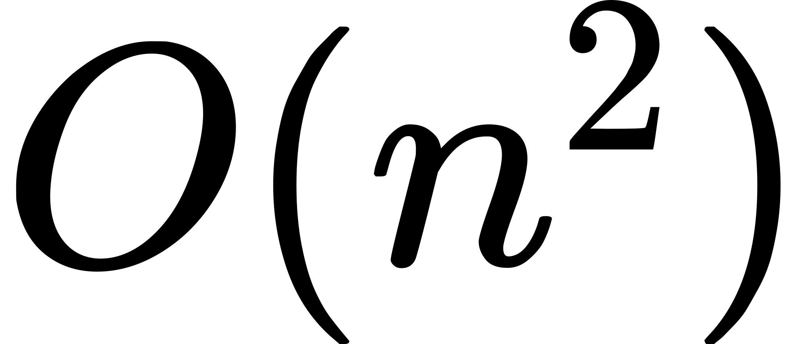

# 84.柱状图中最大的矩形

```ts
/*
 * @lc app=leetcode.cn id=84 lang=typescript
 *
 * [84] 柱状图中最大的矩形
 */

// @lc code=start
function largestRectangleArea(heights: number[]): number {}
// @lc code=end
```

## 解法 1: 暴力枚举

- 时间复杂度: <!-- $O(n^2)$ --> 
- 空间复杂度: <!-- $O(1)$ --> 

```ts
function largestRectangleArea(heights: number[]): number {
  let maxArea = 0
  for (let i = 0; i < heights.length; i++) {
    let min = heights[i]
    for (let j = i; j < heights.length; j++) {
      min = Math.min(min, heights[j])
      maxArea = Math.max(maxArea, min * (j - i + 1))
    }
  }
  return maxArea
}
```

## 解法 2: 暴力枚举优化

- 时间复杂度: <!-- $O(n^2)$ --> 
- 空间复杂度: <!-- $O(1)$ --> 

```ts
function largestRectangleArea(heights: number[]): number {
  let maxArea = 0
  for (let i = 0; i < heights.length; i++) {
    let left = i
    let right = i + 1
    while (right < heights.length && heights[i] <= heights[right]) {
      right++
    }
    while (left >= 0 && heights[i] <= heights[left]) {
      left--
    }

    maxArea = Math.max(maxArea, heights[i] * (right - left - 1))
  }
  return maxArea
}
```

## 解法 3: 使用单调递增栈

- 时间复杂度: <!-- $O(n)$ --> 
- 空间复杂度: <!-- $O(n)$ --> 

```ts
function largestRectangleArea(heights: number[]): number {
  let stack = [{ height: 0, index: -1 }]
  let maxArea = 0
  for (let i = 0; i < heights.length; i++) {
    const right = heights[i]

    while (stack[stack.length - 1].height > right) {
      const cur = stack.pop()!
      const left = stack[stack.length - 1]
      maxArea = Math.max(maxArea, cur.height * (i - left.index - 1))
    }

    stack.push({ height: right, index: i })
  }

  let right = stack[stack.length - 1]

  while (stack.length > 1) {
    let cur = stack.pop()!
    let left = stack[stack.length - 1]
    maxArea = Math.max(maxArea, cur.height * (right.index - left.index))
  }
  return maxArea
}
```

### 优化 1: 在原数组上填充左右边界

- 时间复杂度: <!-- $O(n)$ --> 
- 空间复杂度: <!-- $O(n)$ --> 

更优雅的写法,添加一个右边界 0,这样可以省掉后面的循环的代码,看起来精简很多

- https://leetcode.com/problems/largest-rectangle-in-histogram/discuss/1430546/Monotonique-Stack-Solution-Intuition-(Javascript)

```ts
function largestRectangleArea(heights: number[]): number {
  heights.push(0) // 添加一个右边界 0
  let stack = [{ height: 0, index: -1 }]
  let maxArea = 0
  for (let i = 0; i < heights.length; i++) {
    while (stack[stack.length - 1].height > heights[i]) {
      const height = stack.pop()!.height
      const width = i - stack[stack.length - 1].index - 1
      maxArea = Math.max(maxArea, width * height)
    }
    stack.push({ height: heights[i], index: i })
  }
  return maxArea
}
```

### 优化 2: 利用空值合并运算符处理边界

- 时间复杂度: <!-- $O(n)$ --> 
- 空间复杂度: <!-- $O(n)$ --> 

特殊处理右边界和左边界: 遍历条件使用 `i <= heights.length` 这样最后会超出边界,使用 `-Infinity` 填充,可以将前面所有的数都计算掉;当计算最左边时,超出左边界用 -1 填充.

```ts
function largestRectangleArea(heights: number[]): number {
  const stack: number[] = []
  let res = 0
  for (let i = 0; i <= heights.length; i++) {
    const height = heights[i] ?? -Infinity
    while (stack.length && height < heights[stack[stack.length - 1]]) {
      const cur = heights[stack.pop()!]
      res = Math.max(res, cur * (i - (stack[stack.length - 1] ?? -1) - 1))
    }
    stack.push(i)
  }
  return res
}
```

## Case

```ts
test.each([
  { heights: [2, 1, 5, 6, 2, 3], result: 10 },
  { heights: [2, 4], result: 4 },
  { heights: [2, 1, 2], result: 3 },
  { heights: [1], result: 1 },
  { heights: [0], result: 0 },
])('heights = $heights', ({ heights, result }) => {
  expect(largestRectangleArea(heights!)).toBe(result)
})
```
