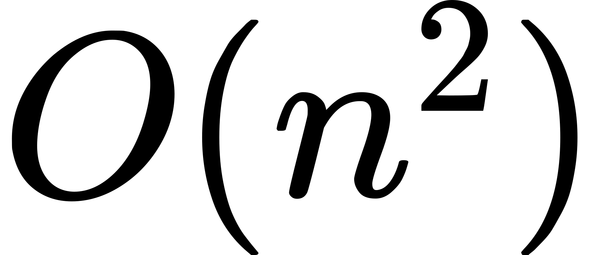

# 918.环形子数组的最大和

```ts
/*
 * @lc app=leetcode.cn id=918 lang=typescript
 *
 * [918] 环形子数组的最大和
 */

// @lc code=start
function maxSubarraySumCircular(nums: number[]): number {}
// @lc code=end
```

## 解法 1: 暴力搜索(超时)

- 时间复杂度: <!-- $O(n^2)$ --> 
- 空间复杂度: <!-- $O(n))$ --> 

```ts
function maxSubarraySumCircular(nums: number[]): number {
  let max = nums[0]
  const n = nums.length

  for (let i = 0; i < n * 2; i++) {
    const start = Math.max(0, i - n)
    const dp = [nums[start]]
    for (let j = 1; j < i - start; j++) {
      dp[j] = Math.max(0, dp[j - 1]) + nums[(j + start) % n]
      max = Math.max(max, dp[j])
    }
  }

  return max
}
```

## 解法 2: 动态规划

- 时间复杂度: <!-- $O(n)$ --> 
- 空间复杂度: <!-- $O(1))$ --> 

总共只有两种情况:

1. 最大和不会越过环,这种情况直接用 [53.最大子数组和](53.最大子数组和.md) 找到最大和
2. 最大和包括环,这种情况下最大和的的区间在 `[j,nums.leng-1],[0,i]`,这种情况下`[i,j]`区间的和肯定是最小的.计算所有数的和 sum,以及最小和 min,就能得到这种情况的最大和 sum-min

然后取这两种情况中的较大者即可

```ts
function maxSubarraySumCircular(nums: number[]): number {
  let [max, maxSum, sum, min, minSum] = [-Infinity, 0, 0, Infinity, 0]
  for (let i = 0; i < nums.length; i++) {
    sum += nums[i]
    maxSum = Math.max(maxSum, 0) + nums[i]
    max = Math.max(max, maxSum)
    if (i > 0 && i < nums.length - 1) {
      minSum = Math.min(minSum, 0) + nums[i]
      min = Math.min(min, minSum)
    }
  }
  return Math.max(max, sum - min)
}
```

## 解法 3: 前缀和

基于 [53.最大子数组和](53.最大子数组和.md) 前缀和的思路,对于之前的最小 sum 值可以基于滑动窗口的思想用优先队列或者双端队列(单调递增栈)进行记录

### 优先队列

```ts
function maxSubarraySumCircular(nums: number[]): number {
  const sums: number[] = []
  for (const num of nums.concat(nums)) {
    sums.push((sums[sums.length - 1] ?? 0) + num)
  }
  let res = -Infinity,
    minHeap = new Heap<number>((a, b) => sums[a] < sums[b])
  for (let i = 0; i < nums.length * 2; i++) {
    while (minHeap.size() && minHeap.top()! + nums.length <= i) minHeap.pop()
    const min = minHeap.size() ? Math.min(sums[minHeap.top()!], sums[i - nums.length] ?? 0) : 0
    res = Math.max(res, sums[i] - min)
    minHeap.push(i)
  }
  return res
}

class Heap<T> {
  private _heap: T[] = []
  constructor(private _comparator: (n1: T, n2: T) => boolean) {}
  private swap(i: number, j: number) {
    ;[this._heap[i], this._heap[j]] = [this._heap[j], this._heap[i]]
  }
  private _has(i: number) {
    return Object.prototype.hasOwnProperty.call(this._heap, i)
  }
  private comparator(i: number, j: number) {
    return this._comparator(this._heap[i], this._heap[j])
  }
  push(node: T) {
    this._heap.push(node)
    let cur = this._heap.length - 1
    let parent = (cur - 1) >> 1
    while (cur > 0 && this.comparator(cur, parent)) {
      this.swap(cur, parent)
      ;[cur, parent] = [parent, (parent - 1) >> 1]
    }
  }
  pop() {
    if (this.size() === 0) return null

    let res = this._heap[0]
    this.swap(0, this._heap.length - 1)
    this._heap.pop()
    let cur = 0,
      left = 2 * cur + 1,
      right = 2 * cur + 2

    while (left < this._heap.length) {
      if (!this._has(right)) right = left
      if (this.comparator(right, left)) [left, right] = [right, left]
      if (this.comparator(cur, left)) break

      this.swap(cur, left)
      cur = left
      ;[left, right] = [2 * cur + 1, 2 * cur + 2]
    }
    return res
  }
  top() {
    if (this.size() === 0) return null

    return this._heap[0]
  }
  size() {
    return this._heap.length
  }
}
```

### 双端队列

```ts
function maxSubarraySumCircular(nums: number[]): number {
  const sums: number[] = []
  for (const num of nums.concat(nums)) {
    sums.push((sums[sums.length - 1] ?? 0) + num)
  }
  let res = -Infinity,
    minHeap = new Deque<number>()
  for (let i = 0; i < sums.length; i++) {
    while (minHeap.size() && minHeap.front()! + nums.length <= i) minHeap.shift()
    let min = sums[i - nums.length] ?? 0
    if (minHeap.size()) {
      min = Math.min(sums[minHeap.front()!], min)
    }
    res = Math.max(res, sums[i] - min)
    while (minHeap.size() && sums[i] <= sums[minHeap.back()!]) minHeap.pop()

    minHeap.push(i)
  }
  return res
}

interface Link<T> {
  val?: T
  next: Link<T> | null
  pre: Link<T> | null
}
class Deque<T> {
  private head: Link<T> = { next: null, pre: null }
  private rear: Link<T> = this.head
  private len: number = 0
  constructor(nodes?: T[]) {
    if (nodes) {
      for (const node of nodes) {
        this.push(node)
      }
    }
  }
  size() {
    return this.len
  }
  push(node: T) {
    const cur: Link<T> = { val: node, next: null, pre: this.rear }
    this.rear.next = cur
    this.rear = cur
    this.len++

    return this.size()
  }
  pop() {
    if (!this.size()) return

    const cur = this.rear
    const pre = cur.pre!
    pre.next = null
    cur.pre = null
    this.rear = pre
    this.len--
    return cur
  }
  unshift(node: T) {
    const next = this.head.next
    const cur: Link<T> = { val: node, next: next, pre: this.head }
    this.head.next = cur
    // 如果 next 为空,则说明之前队列中没有元素,则需要将新添加的元素赋值给 rear
    if (next) {
      next.pre = cur
    } else {
      this.rear = cur
    }
    this.len++

    return this.size()
  }
  shift() {
    if (!this.size()) return

    const cur = this.head.next!
    const next = cur.next
    this.head.next = next
    // 如果 next 存在,说明后面还存在元素,如果不存在,则说明队列中已经没有元素了,需要把 rear 赋值为 null
    if (next) {
      next.pre = this.head
    } else {
      this.rear = this.head
    }
    cur.pre = null
    cur.next = null
    this.len--

    return cur
  }
  front() {
    return this.head.next?.val ?? undefined
  }
  back() {
    return this.rear?.val ?? undefined
  }
}
```

## Case

```ts
test.each([
  { input: { nums: [1, -2, 3, -2] }, output: 3 },
  { input: { nums: [5, -3, 5] }, output: 10 },
  { input: { nums: [3, -1, 2, -1] }, output: 4 },
  { input: { nums: [3, -2, 2, -3] }, output: 3 },
  { input: { nums: [-2, -3, -1] }, output: -1 },
  { input: { nums: [-2] }, output: -2 },
])('input: nums = $input.nums', ({ input: { nums }, output }) => {
  expect(maxSubarraySumCircular(nums)).toBe(output)
})
```
